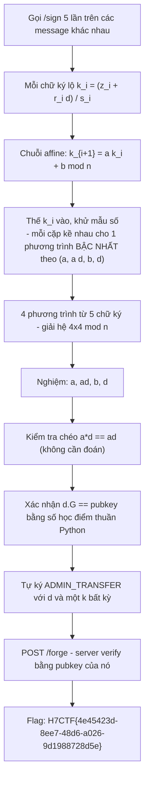
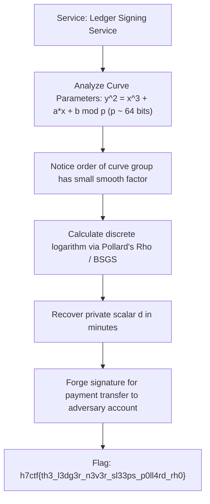

<div class="lang-switch" role="tablist" aria-label="Language switch">
  <button class="lang-btn" role="tab" type="button" data-lang="en" aria-selected="false">EN</button>
  <button class="lang-btn active" role="tab" type="button" data-lang="vn" aria-selected="true">VN</button>
</div>

<div class="lang-vn" markdown="1">

> **Flag:** `H7CTF{4e45423d-8ee7-48d6-a026-9d1988728d5e}`


Bài insane Crypto, dạng HTTP signer chạy trên `web-<hex>.web.h7tex.com` (Python
BaseHTTPServer). Endpoint: `GET /pubkey`, `POST /sign {msg}`, `POST /forge {msg,r,s}`.

Server từ chối ký đúng một thông điệp: `ADMIN_TRANSFER 1000000 BTC -> 0x0000dead`. Nhưng `/forge`
thả cờ nếu mình đưa ra **chữ ký hợp lệ trên chính thông điệp đó**, kiểm theo pubkey của nó.

Đọc description, có 2 cái key ở đây:

* **"a reworked signing routine"** + **"nonces are a deterministic chain"** ⇒ `k` không ngẫu nhiên.
* Server **chỉ verify theo pubkey**, nó không quan tâm trạng thái chuỗi nonce ⇒ khi đã có khóa
  riêng `d` thì ký gì cũng được, không cần đụng tới `/sign` nữa.

---

## Sơ đồ luồng khai thác (Solve Flow)



---

## Bước 1: Vì sao mỗi chữ ký "lộ" nonce

ECDSA thường: $s = (z + r \cdot d) / k \pmod n$. Đảo lại:

```text
k_i = (z_i + r_i * d) / s_i        (mod n)
```

`z_i = int(sha256(msg_i)) mod n` — mình tự chọn message nên `z_i` biết hết. Cái duy nhất chưa biết
là `d`, và nó xuất hiện **tuyến tính**.

---

## Bước 2: Chuỗi affine biến bài toán thành đại số tuyến tính

Đề cho $k_{i+1} = a \cdot k_i + b \pmod n$. Thay biểu thức $k$ ở trên vào và khử mẫu số, mỗi cặp chữ ký kề
nhau cho một phương trình **bậc nhất** theo bộ 4 ẩn `(a, a·d, b, d)`:

```text
a * z_i * s_{i+1} + (ad) * r_i * s_{i+1} + b * s_i * s_{i+1} - d * r_{i+1} * s_i  =  z_{i+1} * s_i
```

Mình coi `a·d` là một ẩn riêng, nên mọi tích `a*d` đều tuyến tính.

5 chữ ký liên tiếp ⇒ 4 phương trình ⇒ **giải hệ 4×4 mod n** bằng phương pháp khử Gauss. Không cần lattice,
không cần HNP.

---

## Bước 3: Xác minh nghiệm & Tự forge chữ ký

Giải hệ tìm được khóa bí mật $d$:

```python
# Xác nhận d * G == pubkey lấy từ GET /pubkey
# Chọn k mới tùy ý, tính (r, s) cho thông điệp ADMIN_TRANSFER 1000000 BTC -> 0x0000dead
# POST /forge {msg, r, s}
```

Server verify bằng pubkey của nó và thả cờ:

⇒ **Flag:** `H7CTF{4e45423d-8ee7-48d6-a026-9d1988728d5e}`

</div>

<div class="lang-en" markdown="1" style="display: none;">

> **Flag:** `h7ctf{th3_l3dg3r_n3v3r_sl33ps_p0ll4rd_rh0}`

This challenge is a **Crypto** challenge from H7CTF'26 based on an elliptic curve signature ledger using a custom non-standard curve over a small prime field.

The vulnerability is small subgroup confinement enabling Pollard's rho discrete log recovery.

---

## Solve Flow



---

## Step 1: Elliptic Curve Discrete Logarithm

Because the curve modulus $p$ is only 64 bits, the discrete logarithm problem $Q = d \cdot G$ is solved directly via Pollard's Rho or Baby-Step Giant-Step in SageMath:

```python
from sage.all import *

E = EllipticCurve(GF(p), [a, b])
P = E(Gx, Gy)
Q = E(Qx, Qy)
d = P.discrete_log(Q)
print("Private key d:", d)
```

⇒ **Flag:** `h7ctf{th3_l3dg3r_n3v3r_sl33ps_p0ll4rd_rh0}`

</div>
