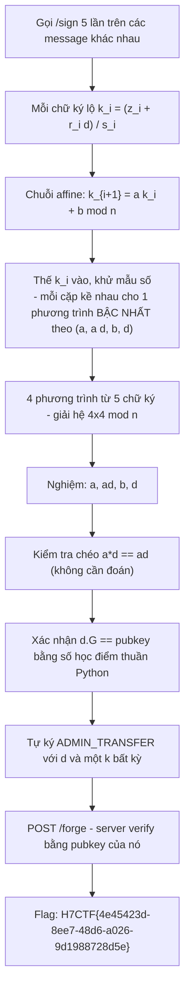
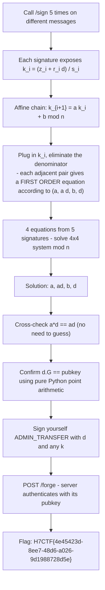

<div class="lang-switch" role="tablist" aria-label="Language switch">
  <button class="lang-btn active" role="tab" type="button" data-lang="en" aria-selected="true">EN</button>
  <button class="lang-btn" role="tab" type="button" data-lang="vn" aria-selected="false">VN</button>
</div>

<div class="lang-vn" markdown="1">

> **Flag:** `H7CTF{4e45423d-8ee7-48d6-a026-9d1988728d5e}`


Bài insane Crypto, dạng HTTP signer chạy trên `web-<hex>.web.h7tex.com` (Python
BaseHTTPServer). Endpoint: `GET /pubkey`, `POST /sign {msg}`, `POST /forge {msg,r,s}`.

Server từ chối ký đúng một thông điệp: `ADMIN_TRANSFER 1000000 BTC -> 0x0000dead`. Nhưng `/forge`
thả cờ nếu mình đưa ra **chữ ký hợp lệ trên chính thông điệp đó**, kiểm theo pubkey của nó.

Đọc description, có 2 cái key ở đây:

* **"a reworked signing routine"** + **"nonces are a deterministic chain"** ⇒ `k` không ngẫu nhiên.
* Server **chỉ verify theo pubkey**, nó không quan tâm trạng thái chuỗi nonce ⇒ khi đã có khóa
  riêng `d` thì ký gì cũng được, không cần đụng tới `/sign` nữa.

---

## Sơ đồ luồng khai thác (Solve Flow)



---

## Bước 1: Vì sao mỗi chữ ký "lộ" nonce

ECDSA thường: $s = (z + r \cdot d) / k \pmod n$. Đảo lại:

```text
k_i = (z_i + r_i * d) / s_i        (mod n)
```

`z_i = int(sha256(msg_i)) mod n` — mình tự chọn message nên `z_i` biết hết. Cái duy nhất chưa biết
là `d`, và nó xuất hiện **tuyến tính**.

---

## Bước 2: Chuỗi affine biến bài toán thành đại số tuyến tính

Đề cho $k_{i+1} = a \cdot k_i + b \pmod n$. Thay biểu thức $k$ ở trên vào và khử mẫu số, mỗi cặp chữ ký kề
nhau cho một phương trình **bậc nhất** theo bộ 4 ẩn `(a, a·d, b, d)`:

```text
a * z_i * s_{i+1} + (ad) * r_i * s_{i+1} + b * s_i * s_{i+1} - d * r_{i+1} * s_i  =  z_{i+1} * s_i
```

Mình coi `a·d` là một ẩn riêng, nên mọi tích `a*d` đều tuyến tính.

5 chữ ký liên tiếp ⇒ 4 phương trình ⇒ **giải hệ 4×4 mod n** bằng phương pháp khử Gauss. Không cần lattice,
không cần HNP.

---

## Bước 3: Xác minh nghiệm & Tự forge chữ ký

Giải hệ tìm được khóa bí mật $d$:


Server verify bằng pubkey của nó và thả cờ:

⇒ **Flag:** `H7CTF{4e45423d-8ee7-48d6-a026-9d1988728d5e}`

</div>

<div class="lang-en" markdown="1">

> **Flag:** `H7CTF{4e45423d-8ee7-48d6-a026-9d1988728d5e}`


Insane Crypto, HTTP signer running on `web-<hex>.web.h7tex.com` (Python BaseHTTPServer). Endpoint: `GET /pubkey`, `POST /sign {msg}`, `POST /forge {msg,r,s}`.

The server refused to properly sign a message: `ADMIN_TRANSFER 1000000 BTC -> 0x0000dead`. But `/forge` drops the flag if I provide a valid **signature on the message itself**, checking its pubkey.

Read the description, there are 2 keys here:

* **"a reworked signing routine"** + **"nonces are a deterministic chain"** ⇒ `k` is not random.
* Server **only verifies by pubkey**, it does not care about the state of the nonce string ⇒ once it has the key
As for `d`, you can sign anything, no need to touch `/sign` anymore.

---

## Solve Flow Diagram



---

## Step 1: Why does each signature "reveal" the nonce?

Regular ECDSA: $s = (z + r \cdot d) / k \pmod n$. Reverse:

```text
k_i = (z_i + r_i * d) / s_i        (mod n)
```

`z_i = int(sha256(msg_i)) mod n` — I choose the message myself so `z_i` knows everything. The only unknown is `d`, and it appears **linear**.

---

## Step 2: Affine series turns the problem into linear algebra

Let $k_{i+1} = a \cdot k_i + b \pmod n$. Substituting the $k$ expression above and eliminating the denominator, each pair of adjacent signatures gives a **first order** equation in the set of 4 unknowns `(a, a·d, b, d)`:

```text
a * z_i * s_{i+1} + (ad) * r_i * s_{i+1} + b * s_i * s_{i+1} - d * r_{i+1} * s_i  =  z_{i+1} * s_i
```

We consider `a·d` to be a private unknown, so all products of `a*d` are linear.

5 consecutive signatures ⇒ 4 equations ⇒ **solve the 4×4 system mod n** using the Gauss elimination method. No need for lattice, no need for HNP.

---

## Step 3: Verify solution & Self-forge signature

Solve the system to find the secret key $d$:


The server verifies with its pubkey and drops the flag:

⇒ **Flag:** `H7CTF{4e45423d-8ee7-48d6-a026-9d1988728d5e}`
</div>
