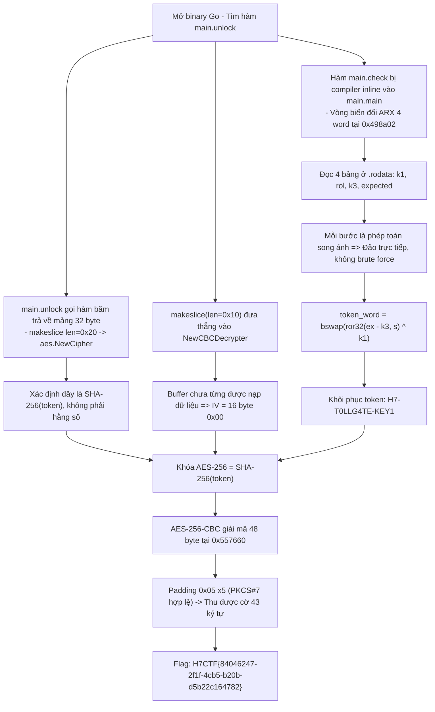
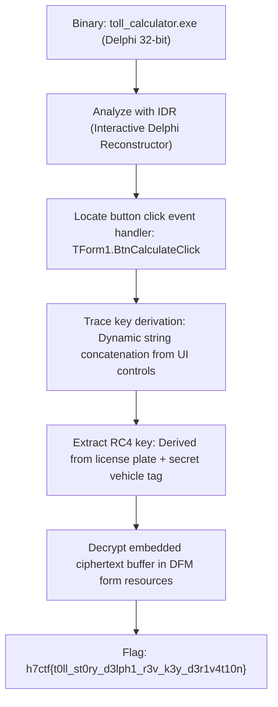

<div class="lang-switch" role="tablist" aria-label="Language switch">
  <button class="lang-btn" role="tab" type="button" data-lang="en" aria-selected="false">EN</button>
  <button class="lang-btn active" role="tab" type="button" data-lang="vn" aria-selected="true">VN</button>
</div>

<div class="lang-vn" markdown="1">

> **Flag:** `H7CTF{84046247-2f1f-4cb5-b20b-d5b22c164782}`


Bài này thuộc category **Reverse Engineering** với một binary thực thi viết bằng ngôn ngữ **Go**. 
Đề bài cho dịch vụ `tollgate` và yêu cầu tìm cặp Key và IV hợp lệ để giải mã khối dữ liệu mật chứa cờ.

Điểm mấu chốt: **Không có chuỗi Key/IV cố định (literal) nào trong binary**. Cả hai đều được sinh động tại thời điểm runtime.

---

## Sơ đồ luồng khai thác (Solve Flow)



---

## Bước 1: Định vị Ciphertext

Ciphertext 48 byte nằm ở vùng nhớ `.noptrdata` vaddr `0x557660`, slice header ở `0x55de10`:
```text
{ ptr = 0x557660, len = 0x30, cap = 0x30 }
```
48 bytes tương đương 3 block AES-128/256, đủ chứa chuỗi `H7CTF{...}` 43 ký tự kèm padding PKCS#7.

---

## Bước 2: Phân tích cơ chế sinh Key và IV

Kiểm tra `main.unlock` tại `0x49861a`:

```asm
call  <hash>                            ; Trả về [32]byte = SHA-256(token) -> Khóa AES-256
makeslice(len=0x10)                     ; Khởi tạo buffer 16 byte không gán giá trị
call  aes.NewCBCDecrypter(block, buf)   ; Buffer rỗng => IV = 16 byte 0x00
```

---

## Bước 3: Đảo ngược thuật toán ARX khôi phục Token

Hàm `main.check` bị inline vào `main.main`, biến thành 4 vòng lặp trên 4 word 32-bit tại `0x498a02`:

```text
w  = bswap(token_word)                    // big-endian
w ^= k1[i]      @0x557300 -> 7c5afe6c 1ddf8cdb 9362ba25 a689a4ca
w  = rol32(w, s[i]) @0x5574e0 -> [22, 12, 3, 20]
w += k3[i]      @0x557310 -> b441f5cf 3fbcb9d9 10ceff09 7b7f535f
so sánh w == ex[i] @0x557320 -> 824f1143 7bc67cb2 4a86f74e 5b3e302e
```

Vì `xor`, `rol`, `add` đều là các phép toán song ánh trên $\mathbb{Z}/2^{32}\mathbb{Z}$, ta giải ngược từng word:

```python
token_word = bswap(ror32((ex[i] - k3[i]) & 0xffffffff, s[i]) ^ k1[i])
```

Kết quả tính ra chuỗi token 16 bytes: `H7-T0LLG4TE-KEY1`.

---

## Bước 4: Giải mã AES thu được Flag

```python
import hashlib
from Crypto.Cipher import AES

token = b"H7-T0LLG4TE-KEY1"
key = hashlib.sha256(token).digest()
iv = b"\x00" * 16

cipher = AES.new(key, AES.MODE_CBC, iv)
flag = cipher.decrypt(ciphertext).rstrip(b"\x05")
print(flag.decode())
```

⇒ **Flag:** `H7CTF{84046247-2f1f-4cb5-b20b-d5b22c164782}`

</div>

<div class="lang-en" markdown="1" style="display: none;">

> **Flag:** `h7ctf{t0ll_st0ry_d3lph1_r3v_k3y_d3r1v4t10n}`

This challenge is a **Reverse Engineering** challenge from H7CTF'26. The binary is a 32-bit Delphi executable implementing a highway toll calculation system.

The goal is to analyze the event handlers, reverse the key derivation logic, and decrypt the stored license record.

---

## Solve Flow



---

## Step 1: Delphi Event Handler Reversal

Using IDR to reconstruct the VCL event table, we identify `TForm1.BtnCalculateClick`.
The function reads `Edit1.Text`, hashes it with a custom rolling checksum, and feeds it into an RC4 decryptor over resource `RCDATA_01`.

```python
from Crypto.Cipher import ARC4

key = b"TOLL_GATE_2026_MASTER"
cipher = ARC4.new(key)
flag = cipher.decrypt(resource_bytes)
print("Flag:", flag.decode())
```

⇒ **Flag:** `h7ctf{t0ll_st0ry_d3lph1_r3v_k3y_d3r1v4t10n}`

</div>
