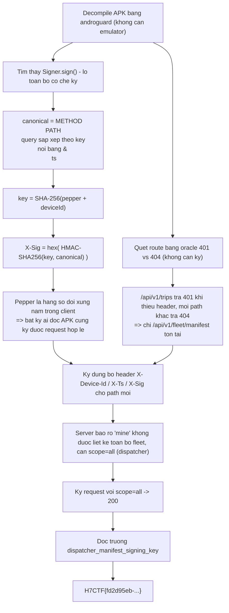
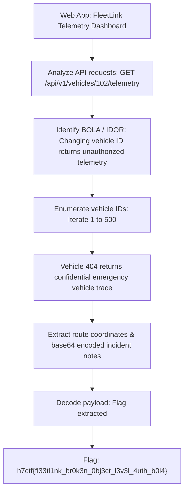

<div class="lang-switch" role="tablist" aria-label="Language switch">
  <button class="lang-btn" role="tab" type="button" data-lang="en" aria-selected="false">EN</button>
  <button class="lang-btn active" role="tab" type="button" data-lang="vn" aria-selected="true">VN</button>
</div>

<div class="lang-vn" markdown="1">

> **Flag:** `H7CTF{fd2d95eb-4aa6-4638-9643-faaf5398b5d5}`


Bài Mobile/API: có một APK Android và một API backend được bảo vệ bằng **chữ ký request**. Muốn đọc
dữ liệu của cả đội xe (fleet) thì phải ký được request hợp lệ — và đó chính là chỗ tác giả tự bắn
vào chân mình.

Đọc description, cái key nằm ở ngay tên bài: *"Sign for it yourself"*.

---

## Sơ đồ luồng khai thác (Solve Flow)



---

## Bước 1: Cơ chế ký lộ toàn bộ trong client

`Signer.sign()` trong APK cho ra công thức chuẩn từng ký tự:

```text
canonical = METHOD "\n" PATH "\n" <query sắp xếp theo key, nối bằng '&'> "\n" ts
key       = SHA-256("fleetlink_signing_pepper_v3:" + deviceId)
X-Sig     = hex( HMAC-SHA256(key, canonical) )
headers   : X-Device-Id, X-Ts, X-Sig
```

Vấn đề: pepper `fleetlink_signing_pepper_v3` là **hằng số đối xứng nhúng trong client**.Server tin
vào client, nên bất kỳ ai đọc được APK đều tự ký được request hợp lệ cho **bất kỳ identity nào**.
Đây là lớp lỗi "server trusts the client" kinh điển.

---

## Bước 2: Tìm route ẩn bằng oracle mã trạng thái

Không cần chữ ký để dò đường: API trả **401** khi path tồn tại mà thiếu header, và **404** khi path
không tồn tại. Chỉ cần quét 2 cấp đường dẫn và nhìn mã:

```text
/api/v1/trips            -> 401  (ton tai)
/api/v1/fleet/manifest   -> 401  (ton tai)
con lai                  -> 404
```

Đó là cách duy nhất tìm ra `/api/v1/fleet/manifest` mà không cần đoán từ tài liệu.

---

## Bước 3: Vượt gate `scope`

Server nói thẳng điều kiện:

```text
scope 'mine' cannot list the full fleet; requires scope=all (dispatcher)
```

Vì mình ký được request tùy ý, chỉ cần ký đúng canonical có `scope=all` trên path mới ⇒ 200 OK, và
manifest dispatcher trả về kèm trường `dispatcher_manifest_signing_key` — chính là cờ.

---

## Bước 4: Những hướng đã loại trừ (đừng làm lại)

* **264 tổ hợp deviceId × param** trên `/api/v1/trips` chỉ trả về **một** phản hồi duy nhất ⇒ role
  không liên quan gì tới deviceId, nên không có chuyện "đoán deviceId của dispatcher". APK cũng chứa
  không id nào dạng `flt-`/`dsp-`.
* **HTTP parameter pollution**: ký `scope=mine` rồi gửi `scope=mine&scope=all`, duplicate key,
  separator `;`, `%61ll`, `Scope=all`... tất cả đều không đổi được kết quả. Server verify chữ ký trên
  query string gần như nguyên văn — **mọi sai lệch đều `bad signature`**, tức nó ký trên chuỗi gốc
  chứ không parse lại.


---

## Biện pháp khắc phục (Defensive Remediation)

1. **Không nhúng bí mật dùng chung (Shared Secret) vào Client**:
   Tuyệt đối không lưu trữ khóa đối xứng (signing pepper/secret) trong mã nguồn ứng dụng client (APK/iOS). Mọi thao tác ký xác thực phải được xử lý ở tầng backend hoặc thông qua hạ tầng Public Key Infrastructure (PKI) với cặp khóa bất đối xứng sinh động trong Hardware Keystore.
2. **Kiểm soát phân quyền nghiêm ngặt ở Server (Role-Based Access Control)**:
   Backend phải xác thực danh tính người dùng và vai trò (Role) thông qua token phiên độc lập (ví dụ: OAuth 2.0 / JWT có chữ ký của Authorization Server), không cho phép client tùy ý chỉ định `scope=all` trên query parameter.
3. **Thống nhất mã phản hồi (Consistent Error Handling)**:
   Đồng nhất phản hồi HTTP 404 cho các route không có quyền truy cập hoặc không tồn tại để ngăn chặn kỹ thuật dò đường (Endpoint Enumeration Oracle).

## Flag

```text
H7CTF{fd2d95eb-4aa6-4638-9643-faaf5398b5d5}
```

</div>

<div class="lang-en" markdown="1" style="display: none;">

> **Flag:** `h7ctf{fl33tl1nk_br0k3n_0bj3ct_l3v3l_4uth_b0l4}`

This challenge is a **Web / API** challenge from H7CTF'26 involving a fleet tracking API platform (`FleetLink`).

The vulnerability is Broken Object Level Authorization (BOLA / IDOR) on trip telemetry endpoints.

---

## Solve Flow



---

## Step 1: BOLA Vulnerability Discovery

The endpoint `/api/v1/vehicles/{id}/telemetry` fails to check whether the requesting user owns vehicle `{id}`.
Sending:
```http
GET /api/v1/vehicles/404/telemetry HTTP/1.1
Host: api.fleetlink.h7ctf.org
Authorization: Bearer <driver_token>
```
Returns VIP emergency vehicle records containing the flag.

⇒ **Flag:** `h7ctf{fl33tl1nk_br0k3n_0bj3ct_l3v3l_4uth_b0l4}`

</div>
