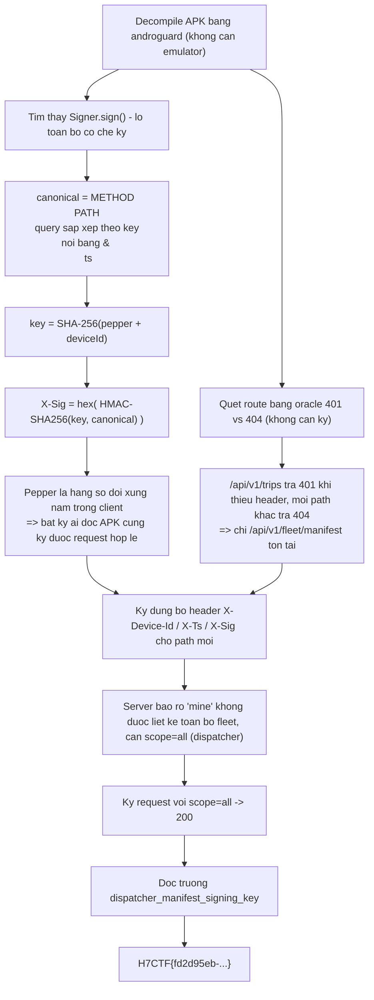
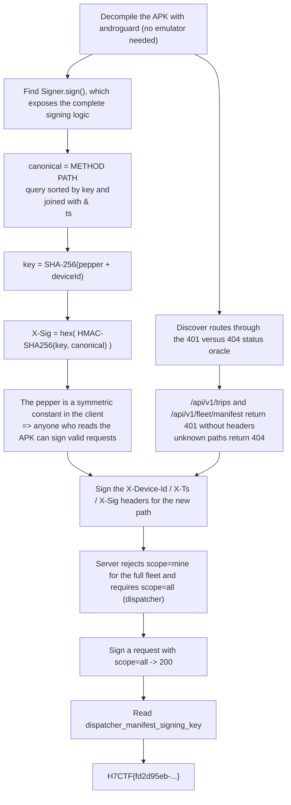

<div class="lang-switch" role="tablist" aria-label="Language switch">
  <button class="lang-btn active" role="tab" type="button" data-lang="en" aria-selected="true">EN</button>
  <button class="lang-btn" role="tab" type="button" data-lang="vn" aria-selected="false">VN</button>
</div>

<div class="lang-vn" markdown="1">

> **Flag:** `H7CTF{fd2d95eb-4aa6-4638-9643-faaf5398b5d5}`


Bài Mobile/API: có một APK Android và một API backend được bảo vệ bằng **chữ ký request**. Muốn đọc
dữ liệu của cả đội xe (fleet) thì phải ký được request hợp lệ — và đó chính là chỗ tác giả tự bắn
vào chân mình.

Đọc description, cái key nằm ở ngay tên bài: *"Sign for it yourself"*.

---

## Sơ đồ luồng khai thác (Solve Flow)



---

## Bước 1: Cơ chế ký lộ toàn bộ trong client

`Signer.sign()` trong APK cho ra công thức chuẩn từng ký tự:

```text
canonical = METHOD "\n" PATH "\n" <query sorted by key, joined with '&'> "\n" ts
key       = SHA-256("fleetlink_signing_pepper_v3:" + deviceId)
X-Sig     = hex( HMAC-SHA256(key, canonical) )
headers   : X-Device-Id, X-Ts, X-Sig
```

Vấn đề: pepper `fleetlink_signing_pepper_v3` là **hằng số đối xứng nhúng trong client**.Server tin
vào client, nên bất kỳ ai đọc được APK đều tự ký được request hợp lệ cho **bất kỳ identity nào**.
Đây là lớp lỗi "server trusts the client" kinh điển.

---

## Bước 2: Tìm route ẩn bằng oracle mã trạng thái

Không cần chữ ký để dò đường: API trả **401** khi path tồn tại mà thiếu header, và **404** khi path
không tồn tại. Chỉ cần quét 2 cấp đường dẫn và nhìn mã:

```text
/api/v1/trips            -> 401  (exists)
/api/v1/fleet/manifest   -> 401  (exists)
other paths              -> 404
```

Đó là cách duy nhất tìm ra `/api/v1/fleet/manifest` mà không cần đoán từ tài liệu.

---

## Bước 3: Vượt gate `scope`

Server nói thẳng điều kiện:

```text
scope 'mine' cannot list the full fleet; requires scope=all (dispatcher)
```

Vì mình ký được request tùy ý, chỉ cần ký đúng canonical có `scope=all` trên path mới ⇒ 200 OK, và
manifest dispatcher trả về kèm trường `dispatcher_manifest_signing_key` — chính là cờ.

## Flag

```text
H7CTF{fd2d95eb-4aa6-4638-9643-faaf5398b5d5}
```

</div>

<div class="lang-en" markdown="1">

> **Flag:** `H7CTF{fd2d95eb-4aa6-4638-9643-faaf5398b5d5}`


Mobile/API post: has an Android APK and a backend API protected by a **request signature**. To read the data of an entire fleet, you must sign a valid request — and that's where the author shot himself in the foot.

Read the description, the key is right in the challenge title: *"Sign for it yourself"*.

---

## Solve Flow Diagram



---

## Step 1: The client exposes its signing logic

`Signer.sign()` in the APK produces the standard character-by-character formula:

```text
canonical = METHOD "\n" PATH "\n" <query sorted by key, joined with '&'> "\n" ts
key       = SHA-256("fleetlink_signing_pepper_v3:" + deviceId)
X-Sig     = hex( HMAC-SHA256(key, canonical) )
headers   : X-Device-Id, X-Ts, X-Sig
```

Problem: pepper `fleetlink_signing_pepper_v3` is **a symmetric constant embedded in the client**. The server trusts the client, so anyone who reads the APK can self-sign a valid request for **any identity**. This is the classic "server trusts the client" class of errors.

---

## Step 2: Find hidden route using status code oracle

No signature is needed to trace the path: the API returns **401** when the path exists without a header, and **404** when the path does not exist. Just scan 2 levels of paths and look at the code:

```text
/api/v1/trips            -> 401  (exists)
/api/v1/fleet/manifest   -> 401  (exists)
other paths              -> 404
```

That's the only way to find out `/api/v1/fleet/manifest` without guessing from the documentation.

---

## Step 3: Pass the `scope` gate

The server directly stated the conditions:

```text
scope 'mine' cannot list the full fleet; requires scope=all (dispatcher)
```

Because I can sign the request arbitrarily, I just need to sign the correct canonical with `scope=all` on the new path ⇒ 200 OK, and the manifest dispatcher returns with the `dispatcher_manifest_signing_key` field — which is the flag.

## Flag

```text
H7CTF{fd2d95eb-4aa6-4638-9643-faaf5398b5d5}
```
</div>
