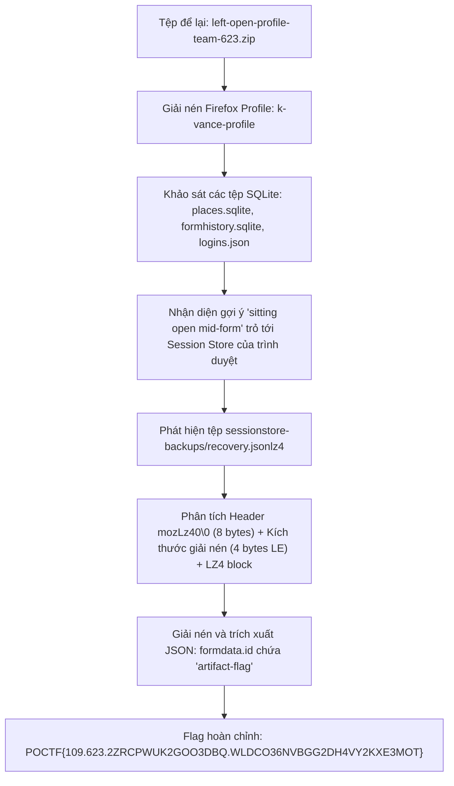
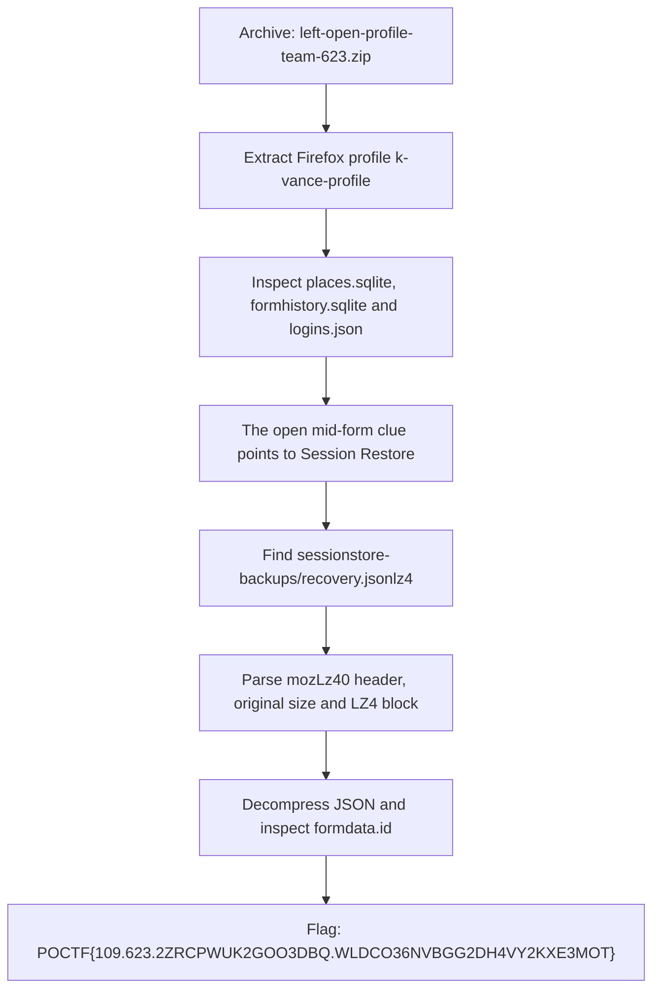

<div class="lang-switch" role="tablist" aria-label="Language switch">
  <button class="lang-btn active" role="tab" type="button" data-lang="en" aria-selected="true">EN</button>
  <button class="lang-btn" role="tab" type="button" data-lang="vn" aria-selected="false">VN</button>
</div>

<div class="lang-vn" markdown="1">

> **Flag:** `POCTF{109.623.2ZRCPWUK2GOO3DBQ.WLDCO36NVBGG2DH4VY2KXE3MOT}`

Thử thách Forensics 100 điểm với đề bài:
> *"A guest left their laptop behind in the hotel room. The machine was unlocked, and the browser was sitting open mid-form. An external IT firm packaged up the profile into a zip.*
> *Find the flag in that session, and pay attention to the details."*

Tệp được cung cấp là `left-open-profile-team-623.zip` (được đóng gói riêng theo từng đội tham gia).

---

## Sơ đồ luồng khai thác (Solve Flow)



---

## Bước 1: Khảo sát Firefox Profile

Giải nén tệp zip thu được cấu trúc thư mục của một profile trình duyệt Mozilla Firefox (`k-vance-profile`):

```text
k-vance-profile/
├── places.sqlite
├── formhistory.sqlite
├── logins.json
├── prefs.js
├── README.txt
└── sessionstore-backups/
    └── recovery.jsonlz4
```

Kiểm tra nội dung các tệp cơ sở dữ liệu SQLite và JSON:
* `places.sqlite`: Lịch sử duyệt web gồm 8 bản ghi liên quan đến cổng lưu trữ tài liệu `catalog.spr.org.uk`.
* `formhistory.sqlite`: Chứa các từ khóa tìm kiếm trước đó.
* `logins.json`: Lưu thông tin tài khoản được mã hóa Base64 đơn giản (`e.marchetti@hollis.edu`).
* `README.txt`: Ghi chú docket điều tra `MARCHETTI/2026-14` với yêu cầu *"Find what she was about to submit"*.

Câu nói *"browser was sitting open mid-form"* là chỉ dẫn trực tiếp tới cơ chế phục hồi phiên (Session Restore) của Firefox. Khi người dùng nhập dữ liệu vào form nhưng chưa bấm submit, nội dung đó được lưu tạm định kỳ trong `sessionstore-backups/recovery.jsonlz4`.

---

## Bước 2: Giải mã định dạng nén Mozilla jsonlz4

Mozilla không sử dụng chuẩn LZ4 thông thường mà đóng gói file dưới định dạng container độc quyền:
* **8 bytes đầu:** Magic bytes `6d 6f 7a 4c 7a 34 30 00` (`mozLz40\0`).
* **4 bytes tiếp theo:** Kích thước dữ liệu gốc chưa nén (unsigned 32-bit integer, little-endian).
* **Phần còn lại:** Dữ liệu nén bằng thuật toán LZ4 Block.

Viết script Python giải nén sử dụng thư viện `lz4.block`:

```python
import struct
import lz4.block
import json
import zipfile

with zipfile.ZipFile("left-open-profile-team-623.zip") as zf:
    blob = zf.read("sessionstore-backups/recovery.jsonlz4")

assert blob[:8] == b"mozLz40\x00", "Invalid mozLz4 magic"

uncompressed_size = struct.unpack("<I", blob[8:12])[0]

decompressed = lz4.block.decompress(blob[12:], uncompressed_size=uncompressed_size)
session_data = json.loads(decompressed.decode("utf-8"))
print(session_data["windows"][0]["tabs"][0]["entries"][0]["formdata"]["id"]["artifact-flag"])
```

---

## Bước 3: Trích xuất Dữ liệu Form và Nhận diện Flag

Dữ liệu phiên khôi phục hiển thị một tab đang mở tại URL:
`https://catalog.spr.org.uk/apparatus/provenance/lssf`

Trong cấu trúc `formdata.id` của trang, toàn bộ thông tin người dùng đang gõ dở được lưu lại đầy đủ:

```json
{
  "workstation": "hollis-office-desktop-elena",
  "analyst-name": "K. Vance",
  "artifact-flag": "POCTF{109.623.2ZRCPWUK2GOO3DBQ.WLDCO36NVBGG2DH4VY2KXE3MOT}",
  "case-notes": "Subject: E. Marchetti disappearance. Chain of custody initiated 2026-06-29..."
}
```

Trường `artifact-flag` mang định dạng chuẩn của Pointer Overflow CTF 2026:
* Challenge ID: `109`
* Team ID: `623`
* Nonce: `2ZRCPWUK2GOO3DBQ` (16 ký tự Base32)
* HMAC Signature: `WLDCO36NVBGG2DH4VY2KXE3MOT` (26 ký tự Base32)

---

## Flag

```text
POCTF{109.623.2ZRCPWUK2GOO3DBQ.WLDCO36NVBGG2DH4VY2KXE3MOT}
```

</div>

<div class="lang-en" markdown="1">

> **Flag:** `POCTF{109.623.2ZRCPWUK2GOO3DBQ.WLDCO36NVBGG2DH4VY2KXE3MOT}`

This 100-point Forensics challenge provides `left-open-profile-team-623.zip`, a Firefox profile named `k-vance-profile` packaged for team 623. The prompt says a guest left an unlocked browser **open mid-form** and asks us to recover what was about to be submitted.

---

## Solve Flow



---

## Step 1: Inspect the Firefox profile

The extracted profile has this structure:

```text
k-vance-profile/
├── places.sqlite
├── formhistory.sqlite
├── logins.json
├── prefs.js
├── README.txt
└── sessionstore-backups/
    └── recovery.jsonlz4
```

`places.sqlite` contains eight browsing-history records related to `catalog.spr.org.uk`; `formhistory.sqlite` stores earlier searches. `logins.json` contains a Base64-encoded account for `e.marchetti@hollis.edu`. `README.txt` references investigation docket `MARCHETTI/2026-14` and asks us to find what she was about to submit. The phrase *open mid-form* directs us to Firefox Session Restore, where unsent form fields are saved in `sessionstore-backups/recovery.jsonlz4`.

---

## Step 2: Decode Mozilla jsonlz4

The file starts with eight magic bytes `6d 6f 7a 4c 7a 34 30 00` (`mozLz40\0`). The next four bytes are the uncompressed size as a little-endian unsigned 32-bit integer; the rest is an LZ4 block. The following script uses `lz4.block` to recover the JSON and print `artifact-flag`:

```python
import struct
import lz4.block
import json
import zipfile

with zipfile.ZipFile("left-open-profile-team-623.zip") as zf:
    blob = zf.read("sessionstore-backups/recovery.jsonlz4")

assert blob[:8] == b"mozLz40\x00", "Invalid mozLz4 magic"

uncompressed_size = struct.unpack("<I", blob[8:12])[0]

decompressed = lz4.block.decompress(blob[12:], uncompressed_size=uncompressed_size)
session_data = json.loads(decompressed.decode("utf-8"))
print(session_data["windows"][0]["tabs"][0]["entries"][0]["formdata"]["id"]["artifact-flag"])
```

---

## Step 3: Read the unsent form data

The restored tab points to `https://catalog.spr.org.uk/apparatus/provenance/lssf`. Its `formdata.id` contains the unsent fields:

```json
{
  "workstation": "hollis-office-desktop-elena",
  "analyst-name": "K. Vance",
  "artifact-flag": "POCTF{109.623.2ZRCPWUK2GOO3DBQ.WLDCO36NVBGG2DH4VY2KXE3MOT}",
  "case-notes": "Subject: E. Marchetti disappearance. Chain of custody initiated 2026-06-29..."
}
```

The flag fields encode challenge ID `109`, team ID `623`, a 16-character nonce `2ZRCPWUK2GOO3DBQ`, and a 26-character signature `WLDCO36NVBGG2DH4VY2KXE3MOT`.

---

## Flag

```text
POCTF{109.623.2ZRCPWUK2GOO3DBQ.WLDCO36NVBGG2DH4VY2KXE3MOT}
```

</div>
