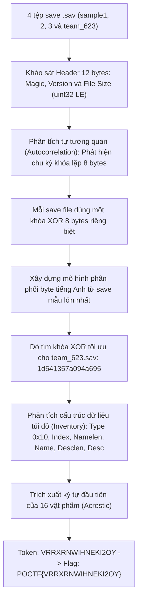
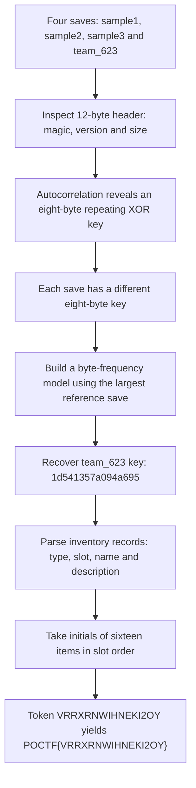

<div class="lang-switch" role="tablist" aria-label="Language switch">
  <button class="lang-btn active" role="tab" type="button" data-lang="en" aria-selected="true">EN</button>
  <button class="lang-btn" role="tab" type="button" data-lang="vn" aria-selected="false">VN</button>
</div>

<div class="lang-vn" markdown="1">

Thử thách Reverse Engineering 100 điểm với đề bài:
> *"Here are some remnants of the fictional dark-fantasy RPG 'Sepulchure of the Undying'. A 16-bit occult horror game. Save format lost. Reverse it from what's left. Four save files recovered from an unlabelled hard drive. Three come from surviving playthroughs... The fourth was written for your team specifically. It carries a 16-character token."*

Hệ thống cung cấp 3 file save mẫu (`sample1.sav`, `sample2.sav`, `sample3.sav`) và một file save sinh riêng cho đội (`team_623.sav`). Cần khôi phục định dạng save file và trích xuất token 16 ký tự.

---

## Sơ đồ luồng khai thác (Solve Flow)



---

## Bước 1: Khảo sát cấu trúc Header và Mã hóa XOR

Kiểm tra 12 byte đầu tiên của cả 4 file save:
```text
9e e1 c7 21 | 02 00 | 02 00 | d2 01 00 00     sample1.sav (466 bytes)
9e e1 c7 21 | 02 00 | 02 00 | 59 03 00 00     sample2.sav (857 bytes)
9e e1 c7 21 | 02 00 | 02 00 | 78 04 00 00     sample3.sav (1144 bytes)
9e e1 c7 21 | 02 00 | 02 00 | 8a 05 00 00     team_623.sav (1418 bytes)
```

Header gồm:
* 4 byte Magic: `\x9e\xe1\xc7!`
* 2 byte Major version: `\x02\x00`
* 2 byte Minor version: `\x02\x00`
* 4 byte uint32 Little-Endian: kích thước tệp (bằng chính xác `len(body) + 12`).

Phần thân (body từ offset 12) được mã hóa. Đo độ tự tương quan tần suất byte `body[i] == body[i+L]` cho thấy các đỉnh rõ rệt tại chu kỳ $L = 8, 16, 24$, khẳng định dữ liệu bị mã hóa bằng thuật toán **XOR lặp chu kỳ 8 byte**.

---

## Bước 2: Khôi phục Khóa XOR bằng Mô hình Phân phối Ngôn ngữ

Dữ liệu nguyên bản sau khi giải mã XOR có dạng `body = struct ^ 0x20 ^ key[i % 8]`.

Mỗi tệp save sở hữu một khóa 8 byte riêng:
* `sample1.sav`: `bff366a0192308a7` (Nhân vật: `Iri Vess`)
* `sample2.sav`: `8ee28d4183df8c1b` (Nhân vật: `Mercer Thale`)
* `sample3.sav`: `e62903e8dcf7b038` (Nhân vật: `Ollary Wren`)

Sử dụng `sample3` (tệp mẫu có dung lượng văn bản lớn nhất) để huấn luyện mô hình phân phối tần suất byte (`byte_model`), sau đó tìm kiếm vét cạn 256 giá trị cho từng byte trong 8 byte khóa của `team_623.sav` để tối đa hóa điểm số xác suất:

Khóa khôi phục được cho `team_623.sav`:
$$\mathbf{K_{\text{team}} = \texttt{1d541357a094a695}}$$

---

## Bước 3: Đọc Cấu trúc Túi đồ (Inventory) & Trích xuất Acrostic Token

Sau khi giải mã `team_623.sav`, tên nhân vật là `K. Ansen`.

Quét tìm cấu trúc danh sách vật phẩm theo mẫu record:
`[0x10][Slot: 1B][Field_A: 1B][Field_B: 1B][Namelen: 1B][Name][Desclen: 2B LE][Desc]`

Tệp `team_623.sav` chứa đúng 16 vật phẩm:

| Slot | Tên vật phẩm | Mô tả |
| :---: | :--- | :--- |
| 0 | **V**essel-key | Fits the mouth of every empty flask. |
| 1 | **R**usted spirit-medallion | Illegible engraving. Legible weight. |
| 2 | **R**usted spirit-medallion | Illegible engraving. Legible weight. |
| 3 | **X**ylophone plate | Struck once; still ringing. |
| 4 | **R**usted spirit-medallion | Illegible engraving. Legible weight. |
| 5 | **N**eedle of the Bureau | Points at your own signature. |
| 6 | **W**idow's brass compass | The needle sulks. |
| 7 | **I**vory dial-plate | Twelve marks. Only nine of them tick. |
| 8 | **H**air-braid amulet | Not yours. Old. Not old enough. |
| 9 | **N**eedle of the Bureau | Points at your own signature. |
| 10 | **E**mber-in-glass | Warm regardless of the room. |
| 11 | **K**notted willow charm | Untying it is a moral act. |
| 12 | **I**vory dial-plate | Twelve marks. Only nine of them tick. |
| 13 | **2**-star runic band | Middle rank of a discontinued order. |
| 14 | **O**bsidian censer | Smells faintly of camphor. |
| 15 | **Y**ew-stem staff | Cut on a Sunday it should not have been. |

Ghép các chữ cái đầu tiên của 16 vật phẩm theo thứ tự slot (Acrostic cipher):
$$\text{Token} = \mathbf{\texttt{VRRXRNWIHNEKI2OY}}$$

⇒ **Flag:** `POCTF{VRRXRNWIHNEKI2OY}`

</div>

<div class="lang-en" markdown="1">

This 100-point Reverse Engineering challenge asks us to reconstruct the save format of the fictional 16-bit occult RPG Sepulchure of the Undying. We receive three reference saves (`sample1.sav`, `sample2.sav`, `sample3.sav`) and one team-specific file (`team_623.sav`) containing a 16-character token.

---

## Solve Flow



---

## Step 1: Inspect the header and XOR encoding

The first twelve bytes of each file are unencrypted:

```text
9e e1 c7 21 | 02 00 | 02 00 | d2 01 00 00     sample1.sav (466 bytes)
9e e1 c7 21 | 02 00 | 02 00 | 59 03 00 00     sample2.sav (857 bytes)
9e e1 c7 21 | 02 00 | 02 00 | 78 04 00 00     sample3.sav (1144 bytes)
9e e1 c7 21 | 02 00 | 02 00 | 8a 05 00 00     team_623.sav (1418 bytes)
```

They consist of the four-byte magic `\x9e\xe1\xc7!`, major version `\x02\x00`, minor version `\x02\x00`, and a little-endian uint32 file size equal to `len(body) + 12`. Byte autocorrelation measures `body[i] == body[i+L]` and peaks at periods 8, 16, and 24, pointing to a repeating eight-byte XOR key.

---

## Step 2: Recover the XOR key

The plaintext relation is `body = struct ^ 0x20 ^ key[i % 8]`. Each save has its own eight-byte key. The reference keys are `bff366a0192308a7` for `sample1.sav` (`Iri Vess`), `8ee28d4183df8c1b` for `sample2.sav` (`Mercer Thale`), and `e62903e8dcf7b038` for `sample3.sav` (`Ollary Wren`).

The largest reference save, `sample3`, provides an English byte-frequency model (`byte_model`). Testing all 256 values independently at each of the eight key positions against that model recovers:

$$\mathbf{K_{\text{team}} = \texttt{1d541357a094a695}}$$

---

## Step 3: Parse inventory records and extract the acrostic

The decoded `team_623.sav` identifies the character as `K. Ansen`. Inventory records have the structure:
`[0x10][Slot: 1B][Field_A: 1B][Field_B: 1B][Namelen: 1B][Name][Desclen: 2B LE][Desc]`.

There are sixteen items, in slot order:

| Slot | Item | Description |
| :---: | :--- | :--- |
| 0 | **V**essel-key | Fits the mouth of every empty flask. |
| 1 | **R**usted spirit-medallion | Illegible engraving. Legible weight. |
| 2 | **R**usted spirit-medallion | Illegible engraving. Legible weight. |
| 3 | **X**ylophone plate | Struck once; still ringing. |
| 4 | **R**usted spirit-medallion | Illegible engraving. Legible weight. |
| 5 | **N**eedle of the Bureau | Points at your own signature. |
| 6 | **W**idow's brass compass | The needle sulks. |
| 7 | **I**vory dial-plate | Twelve marks. Only nine of them tick. |
| 8 | **H**air-braid amulet | Not yours. Old. Not old enough. |
| 9 | **N**eedle of the Bureau | Points at your own signature. |
| 10 | **E**mber-in-glass | Warm regardless of the room. |
| 11 | **K**notted willow charm | Untying it is a moral act. |
| 12 | **I**vory dial-plate | Twelve marks. Only nine of them tick. |
| 13 | **2**-star runic band | Middle rank of a discontinued order. |
| 14 | **O**bsidian censer | Smells faintly of camphor. |
| 15 | **Y**ew-stem staff | Cut on a Sunday it should not have been. |

Reading each item's first character by slot produces the token VRRXRNWIHNEKI2OY.

⇒ **Flag:** `POCTF{VRRXRNWIHNEKI2OY}`

</div>
