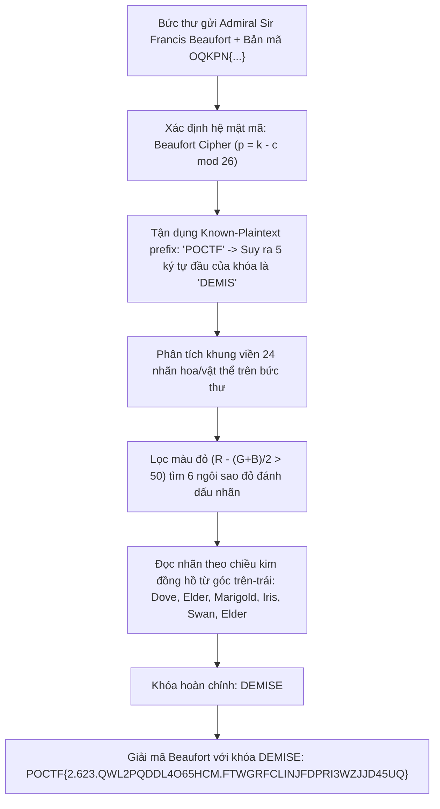
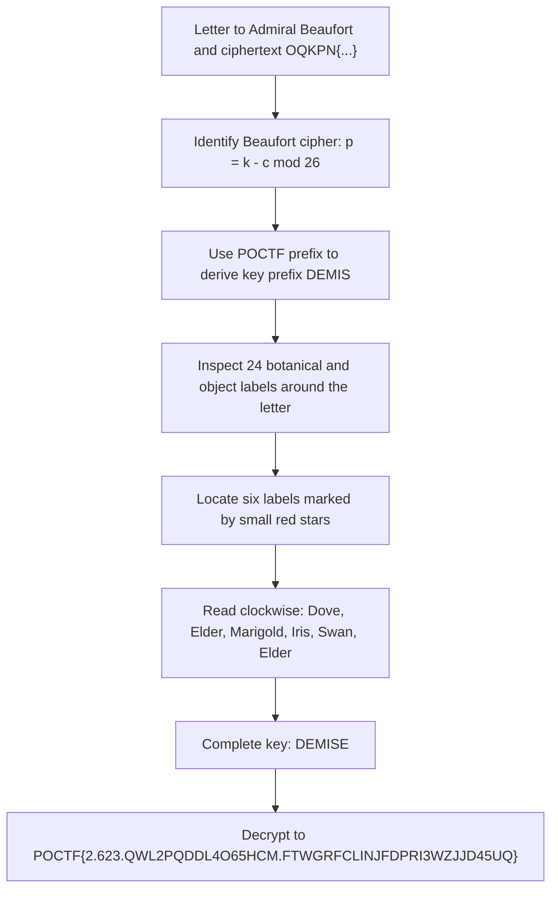

<div class="lang-switch" role="tablist" aria-label="Language switch">
  <button class="lang-btn active" role="tab" type="button" data-lang="en" aria-selected="true">EN</button>
  <button class="lang-btn" role="tab" type="button" data-lang="vn" aria-selected="false">VN</button>
</div>

<div class="lang-vn" markdown="1">

> **Flag:** `POCTF{2.623.QWL2PQDDL4O65HCM.FTWGRFCLINJFDPRI3WZJJD45UQ}`

Thử thách Cryptography 100 điểm với đề bài:
> *"Here we have a letter that was recovered from the estate of Dr. H. Aldous Whitmore. It was never posted. Along with the letter, a strange message was discovered. We have no doubt that Dr. Whitmore meant to keep it secret, given his... Association with occult societies that was discovered after his death. Despite this, the relationship to the letter remains unclear, but a connection cannot be discounted.*  
> *Find the key the letter hides, and read what Whitmore could not bring himself to send."*

Bản mã được cấp trên thẻ thử thách của đội:
```text
OQKPN{2.623.OHT2XSPBS4Q65FGG.ZKIGRNCSWZZNBONE3MTVUB45SS}
```

---

## Sơ đồ luồng khai thác (Solve Flow)



---

## Bước 1: Nhận diện Hệ Mật mã Beaufort

Bức thư viết tay gửi tới:
> *"To Admiral Sir Francis Beaufort, K.C.B. - Hydrographer to the Navy"*

Nội dung bức thư ca ngợi: *"the elegance of your method — that reciprocal tableau which bears your name"*.  
Đây là chỉ dẫn trực tiếp tới **Beaufort Cipher** (bảng mã tự nghịch đảo do Francis Beaufort phát minh), trong đó quá trình mã hóa và giải mã đều tuân theo công thức:

$$p = (k - c) \pmod{26}$$
$$c = (k - p) \pmod{26}$$

Với $p$ là ký tự rõ (plaintext), $c$ là ký tự mã (ciphertext), và $k$ là ký tự khóa (key).

---

## Bước 2: Suy luận Tiền tố Khóa từ Known-Plaintext

Mọi flag của giải đấu đều bắt đầu bằng `POCTF{`. Đối chiếu tiền tố 5 ký tự:
* $c = \text{"OQKPN"}$
* $p = \text{"POCTF"}$

Từ $p = (k - c) \pmod{26} \implies k = (p + c) \pmod{26}$:
* $k_0 = ('P' + 'O') \bmod 26 = (15 + 14) \bmod 26 = 3 \implies \mathbf{D}$
* $k_1 = ('O' + 'Q') \bmod 26 = (14 + 16) \bmod 26 = 4 \implies \mathbf{E}$
* $k_2 = ('C' + 'K') \bmod 26 = (2 + 10) \bmod 26 = 12 \implies \mathbf{M}$
* $k_3 = ('T' + 'P') \bmod 26 = (19 + 15) \bmod 26 = 8 \implies \mathbf{I}$
* $k_4 = ('F' + 'N') \bmod 26 = (5 + 13) \bmod 26 = 18 \implies \mathbf{S}$

Tiền tố của khóa chắc chắn là **`DEMIS`**.

---

## Bước 3: Đọc Khóa Hoàn Chỉnh từ Khung Viền Bức Thư

Khung viền của bức thư chứa 24 nhãn (6 nhãn ở mỗi cạnh: trên, phải, dưới, trái). Trên viền có đúng 6 nhãn được đánh dấu bằng một **ngôi sao nhỏ màu đỏ**.

Phân tích điểm màu đỏ $R - (G+B)/2 \ge 50$ định vị chính xác tọa độ của 6 ngôi sao:
1. Cạnh trên (Top), slot 1: **Dove** $\rightarrow$ `D`
2. Cạnh trên (Top), slot 4: **Elder** $\rightarrow$ `E`
3. Cạnh phải (Right), slot 1: **Marigold** $\rightarrow$ `M`
4. Cạnh dưới (Bottom), slot 4: **Iris** $\rightarrow$ `I`
5. Cạnh dưới (Bottom), slot 0: **Swan** $\rightarrow$ `S`
6. Cạnh trái (Left), slot 1: **Elder** $\rightarrow$ `E`

Đọc theo chiều kim đồng hồ bắt đầu từ góc trên-trái, ghép các chữ cái đầu tiên thu được từ tiếng Anh:
$$\mathbf{D - E - M - I - S - E} \implies \text{"DEMISE"}$$

Từ DEMISE (sự qua đời / di sản của người đã khuất) hoàn toàn khớp với bối cảnh *"recovered from the estate of Dr. Whitmore"* của đề bài.

---

## Bước 4: Giải mã Beaufort và Thu nhận Flag

Áp dụng giải mã Beaufort với khóa `DEMISE` (quy tắc chỉ tiến khóa khi gặp ký tự chữ cái `A-Z`, giữ nguyên số và dấu chấm):

```python
def beaufort_decrypt(ciphertext, key):
    K = [ord(c) - 65 for c in key.upper()]
    out = []
    ki = 0
    for ch in ciphertext:
        if ch.isalpha():
            c_val = ord(ch.upper()) - 65
            p_val = (K[ki % len(K)] - c_val) % 26
            out.append(chr(p_val + 65))
            ki += 1
        else:
            out.append(ch)
    return "".join(out)

ciphertext = "OQKPN{2.623.OHT2XSPBS4Q65FGG.ZKIGRNCSWZZNBONE3MTVUB45SS}"
flag = beaufort_decrypt(ciphertext, "DEMISE")
print("Flag:", flag)
```

Kết quả giải mã:
```text
POCTF{2.623.QWL2PQDDL4O65HCM.FTWGRFCLINJFDPRI3WZJJD45UQ}
```

Cấu trúc flag hoàn toàn hợp lệ:
* Challenge ID: `2`
* Team ID: `623`
* Nonce: `QWL2PQDDL4O65HCM` (16 ký tự Base32)
* Signature: `FTWGRFCLINJFDPRI3WZJJD45UQ` (26 ký tự Base32 HMAC-SHA256)

</div>

<div class="lang-en" markdown="1">

> **Flag:** `POCTF{2.623.QWL2PQDDL4O65HCM.FTWGRFCLINJFDPRI3WZJJD45UQ}`

This 100-point Cryptography challenge provides an unposted letter recovered from Dr. H. Aldous Whitmore's estate. We must find the key hidden in the letter and decrypt the team-specific message:

```text
OQKPN{2.623.OHT2XSPBS4Q65FGG.ZKIGRNCSWZZNBONE3MTVUB45SS}
```

---

## Solve Flow



---

## Step 1: Identify the Beaufort cipher

The letter is addressed *"To Admiral Sir Francis Beaufort, K.C.B. - Hydrographer to the Navy"* and praises the *"reciprocal tableau which bears your name"*. This points to the Beaufort cipher, whose encryption and decryption use the same reciprocal relation:

$$p = (k - c) \pmod{26}$$
$$c = (k - p) \pmod{26}$$

Here $p$ is plaintext, $c$ is ciphertext, and $k$ is the key character.

---

## Step 2: Derive the key prefix from known plaintext

Every flag starts with `POCTF{`, while the message starts with OQKPN{. Thus $k=(p+c)\pmod{26}$ gives `DEMIS` for the first five key characters: P+O→`D`, O+Q→`E`, C+K→`M`, T+P→`I`, and F+N→`S`.

---

## Step 3: Complete the key from the letter border

The letter border has 24 labels, six on each side. Six carry small red stars; a red-pixel threshold $R-(G+B)/2\ge 50$ helps locate them. Reading clockwise from the upper-left gives:

1. Top, slot 1: Dove (D)
2. Top, slot 4: Elder (E)
3. Right, slot 1: Marigold (M)
4. Bottom, slot 4: Iris (I)
5. Bottom, slot 0: Swan (S)
6. Left, slot 1: Elder (E)

Their initials spell `DEMISE`, fitting the reference to Whitmore's estate.

---

## Step 4: Decrypt the message

The key advances only for letters `A-Z`; numbers and punctuation remain unchanged. Applying the Beaufort relation with `DEMISE`:

```python
def beaufort_decrypt(ciphertext, key):
    K = [ord(c) - 65 for c in key.upper()]
    out = []
    ki = 0
    for ch in ciphertext:
        if ch.isalpha():
            c_val = ord(ch.upper()) - 65
            p_val = (K[ki % len(K)] - c_val) % 26
            out.append(chr(p_val + 65))
            ki += 1
        else:
            out.append(ch)
    return "".join(out)

ciphertext = "OQKPN{2.623.OHT2XSPBS4Q65FGG.ZKIGRNCSWZZNBONE3MTVUB45SS}"
flag = beaufort_decrypt(ciphertext, "DEMISE")
print("Flag:", flag)
```

The output is:

```text
POCTF{2.623.QWL2PQDDL4O65HCM.FTWGRFCLINJFDPRI3WZJJD45UQ}
```

The fields contain challenge ID `2`, team ID `623`, nonce `QWL2PQDDL4O65HCM`, and signature `FTWGRFCLINJFDPRI3WZJJD45UQ`.

</div>
