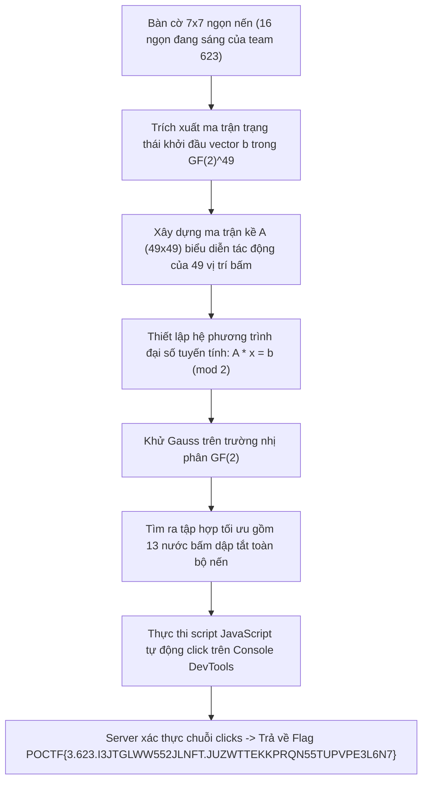
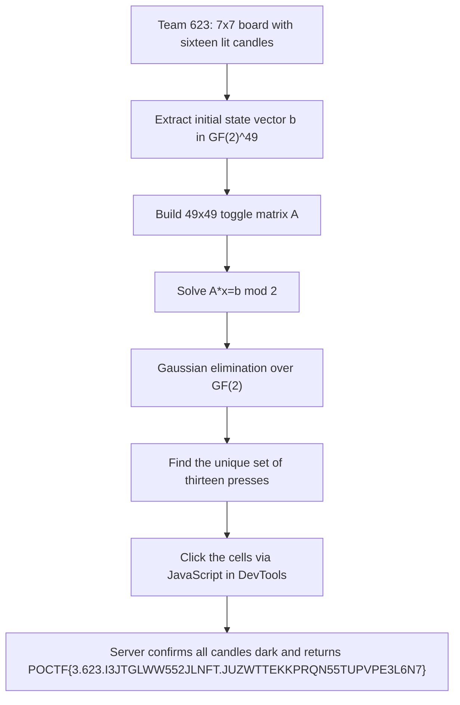

<div class="lang-switch" role="tablist" aria-label="Language switch">
  <button class="lang-btn active" role="tab" type="button" data-lang="en" aria-selected="true">EN</button>
  <button class="lang-btn" role="tab" type="button" data-lang="vn" aria-selected="false">VN</button>
</div>

<div class="lang-vn" markdown="1">

Thử thách Misc 100 điểm với đề bài:
> *"I see something... It's... Some kind of machine. A séance apparatus. Forty-nine candles arranged in a seven-by-seven grid. I remember this, somehow. To invoke, the operator must snuff them all.*
> *Press, to quiet. Each press stirs the four cardinal neighbors equally. When every candle is dark, the apparatus will speak its name.*
> *The apparatus permits any sequence of presses. The order does not matter, only the set. A reset returns the board to its initial state — your team's pattern is your own."*

Trang web mô phỏng trò chơi kinh điển **Lights Out** trên lưới $7 \times 7$ gồm 49 ngọn nến. Mỗi lần bấm vào một ô sẽ đảo trạng thái của chính ô đó và 4 ô kề cạnh (trên, dưới, trái, phải). Mục tiêu là dập tắt toàn bộ 49 ngọn nến để apparatus đọc tên và trả về Flag tương ứng với team ID `623`.

---

## Sơ đồ luồng khai thác (Solve Flow)



---

## Bước 1: Trích xuất Trạng thái Bàn cờ Khởi đầu

Từ giao diện bàn cờ của đội, trích xuất lưới $7 \times 7$ (`#` là nến đang sáng, `.` là nến đã tắt):

```text
.#..#..
.###.#.
....#.#
.#...#.
..#....
#.#..##
#......
```

Có đúng 16 ngọn nến đang sáng tại các tọa độ `(row, col)` (0-indexed):
* Hàng 0: `(0, 1)`, `(0, 4)`
* Hàng 1: `(1, 1)`, `(1, 2)`, `(1, 3)`, `(1, 5)`
* Hàng 2: `(2, 4)`, `(2, 6)`
* Hàng 3: `(3, 1)`, `(3, 5)`
* Hàng 4: `(4, 2)`
* Hàng 5: `(5, 0)`, `(5, 2)`, `(5, 5)`, `(5, 6)`
* Hàng 6: `(6, 0)`

---

## Bước 2: Đại số tuyến tính trên trường nhị phân $\mathbb{F}_2$

Do phép đảo trạng thái (XOR) có tính chất giao hoán (thứ tự bấm không quan trọng) và tự nghịch đảo (bấm 2 lần tương đương không bấm), bài toán Lights Out hoàn toàn quy về việc giải hệ phương trình tuyến tính trên trường hữu hạn $\mathbb{F}_2$:

$$A \cdot x \equiv b \pmod 2$$

Trong đó:
* $b \in \mathbb{F}_2^{49}$ là vector trạng thái ban đầu của 49 ô (1 nếu nến sáng, 0 nếu nến tối).
* $x \in \mathbb{F}_2^{49}$ là vector ẩn số cần tìm ($x_j = 1$ nghĩa là cần bấm ô thứ $j$).
* $A \in \mathbb{F}_2^{49 \times 49}$ là ma trận tác động: cột $j$ chứa giá trị 1 tại ô $j$ và các ô kề cạnh của $j$.

Thực hiện khử Gauss (Gaussian Elimination) trên $\mathbb{F}_2$:
Hệ đạt hạng $\text{rank}(A) = 49$, không có biến tự do, nghiệm là duy nhất với đúng **13 vị trí bấm**:

* Theo tọa độ 0-indexed `(row, col)`:
  `[(0, 2), (1, 2), (1, 3), (1, 4), (3, 2), (3, 3), (3, 6), (4, 4), (4, 6), (5, 4), (6, 0), (6, 2), (6, 3)]`
* Theo nhãn `aria-label` của trang web (1-indexed):
  `r1c3, r2c3, r2c4, r2c5, r4c3, r4c4, r4c7, r5c5, r5c7, r6c5, r7c1, r7c3, r7c4`

---

## Bước 3: Thực thi tự động và Nhận Flag

Mở Developer Tools (F12) trên Chrome tại trang thử thách `/challenges/the-apparatus-invocation/` và dán đoạn mã sau vào tab **Console**:

```javascript
(() => {
  const P = [[0, 2], [1, 2], [1, 3], [1, 4], [3, 2], [3, 3], [3, 6], [4, 4], [4, 6], [5, 4], [6, 0], [6, 2], [6, 3]];
  for (const [r, c] of P) {
    document.querySelector(`#board .cell[data-r="${r}"][data-c="${c}"]`).click();
  }
  return 'All candles darkened!';
})()
```

Ngay sau khi click đủ 13 vị trí, toàn bộ 49 ngọn nến chuyển sang màu tối, giao diện tự động gửi request nộp danh sách clicks lên server và hiển thị Flag:

⇒ **Flag:** `POCTF{3.623.I3JTGLWW552JLNFT.JUZWTTEKKPRQN55TUPVPE3L6N7}`

</div>

<div class="lang-en" markdown="1">

This 100-point Misc challenge presents a **Lights Out** puzzle for team ID `623` with 49 candles in a $7 \times 7$ grid. Pressing a cell toggles that candle and its four cardinal neighbors. We must darken every candle to obtain the team-623 flag. The order of presses does not matter; resetting restores the team's starting pattern.

---

## Solve Flow



---

## Step 1: Extract the initial board

For team 623, `#` means lit and `.` means dark:

```text
.#..#..
.###.#.
....#.#
.#...#.
..#....
#.#..##
#......
```

The sixteen lit cells, using zero-based `(row, col)`, are `(0, 1)`, `(0, 4)`, `(1, 1)`, `(1, 2)`, `(1, 3)`, `(1, 5)`, `(2, 4)`, `(2, 6)`, `(3, 1)`, `(3, 5)`, `(4, 2)`, `(5, 0)`, `(5, 2)`, `(5, 5)`, `(5, 6)`, and `(6, 0)`.

---

## Step 2: Solve over $\mathbb{F}_2$

Presses commute and pressing twice cancels out, so the board is a linear system over $\mathbb{F}_2$:
$$A x \equiv b \pmod 2$$

Here $b \in \mathbb{F}_2^{49}$ is the starting state, $x \in \mathbb{F}_2^{49}$ marks which cells to press, and column $j$ of $A \in \mathbb{F}_2^{49\times49}$ toggles cell $j$ and its cardinal neighbors. Gaussian elimination gives $\mathrm{rank}(A)=49$, so the solution is unique and contains thirteen presses.

The zero-based coordinates are `[(0, 2), (1, 2), (1, 3), (1, 4), (3, 2), (3, 3), (3, 6), (4, 4), (4, 6), (5, 4), (6, 0), (6, 2), (6, 3)]`. The page's one-based `aria-label` values are `r1c3, r2c3, r2c4, r2c5, r4c3, r4c4, r4c7, r5c5, r5c7, r6c5, r7c1, r7c3, r7c4`.

---

## Step 3: Click the solution and obtain the flag

On `/challenges/the-apparatus-invocation/`, paste this into the browser DevTools Console:

```javascript
(() => {
  const P = [[0, 2], [1, 2], [1, 3], [1, 4], [3, 2], [3, 3], [3, 6], [4, 4], [4, 6], [5, 4], [6, 0], [6, 2], [6, 3]];
  for (const [r, c] of P) {
    document.querySelector(`#board .cell[data-r="${r}"][data-c="${c}"]`).click();
  }
  return 'All candles darkened!';
})()
```

After the thirteenth click, the page submits the press history and shows:

⇒ **Flag:** `POCTF{3.623.I3JTGLWW552JLNFT.JUZWTTEKKPRQN55TUPVPE3L6N7}`

</div>
