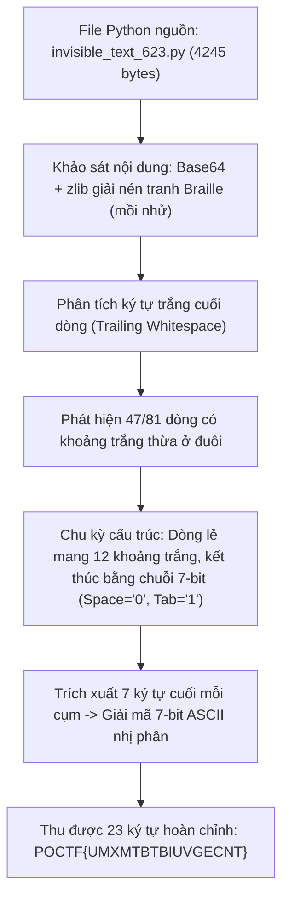
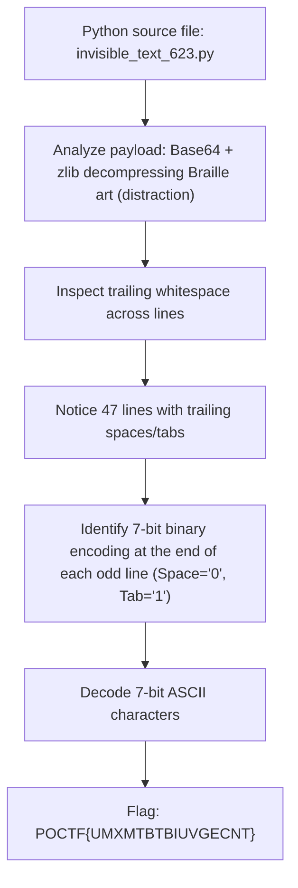

<div class="lang-switch" role="tablist" aria-label="Language switch">
  <button class="lang-btn active" role="tab" type="button" data-lang="en" aria-selected="true">EN</button>
  <button class="lang-btn" role="tab" type="button" data-lang="vn" aria-selected="false">VN</button>
</div>

<div class="lang-vn" markdown="1">

Thử thách Steganography 200 điểm tại Pointer Overflow CTF 2026.
Đề bài cung cấp tệp mã nguồn Python duy nhất mang tên `invisible_text_623.py` (sinh riêng cho đội `623`). Gợi ý: thông điệp bí mật được cất giấu ngay bên trong tệp nguồn và chỉ cần *"look closely"* tại vị trí thích hợp.

---

## Sơ đồ luồng khai thác (Solve Flow)



---

## Bước 1: Khảo sát Tệp Nguồn và Nhận diện Mồi Nhử (Distraction)

Tệp `invisible_text_623.py` chứa một đoạn mã `diary_reader.py` nối 46 chuỗi Base64:

```python
import base64
import zlib

chunks = [...]
raw = b"".join(base64.b64decode(c) for c in chunks)
print(zlib.decompress(raw).decode('utf-8'))
```

Khi chạy giải mã zlib, dữ liệu xuất ra là một bức tranh vẽ bằng chữ Braille (2145 ký tự U+2800..U+28FF). Phân tích histogram số chấm và cấu trúc Braille cho thấy đây hoàn toàn là ảnh đồ họa nghệ thuật, không chứa bit dữ liệu hay flag ẩn.

---

## Bước 2: Phân tích Ký tự Ẩn cuối dòng (Trailing Whitespace)

Kiểm tra ký tự vô hình (invisible characters) và ký tự trắng ở đuôi dòng:

```python
with open("invisible_text_623.py", "r", encoding="utf-8") as f:
    lines = f.readlines()

for idx, line in enumerate(lines, 1):
    raw_tail = line.rstrip("\r\n")
    stripped = raw_tail.rstrip(" \t")
    trailing = raw_tail[len(stripped):]
    if trailing:
        print(f"Line {idx:2d}: len={len(trailing):2d} repr={trailing.replace(' ', 'S').replace('\t', 'T')}")
```

Kết quả:
* Có đúng 47 dòng kết thúc bằng khoảng trắng dư thừa.
* Các dòng chẵn chỉ chứa đúng một ký tự Tab (`\t`) đóng vai trò phân tách.
* Các dòng dữ liệu (dòng lẻ) có độ dài 12 ký tự (riêng dòng 1 có 10 ký tự): 5 ký tự đầu là khoảng trắng đệm (`Space`), và **7 ký tự cuối** luôn bắt đầu bằng một ký tự Tab (`\t`).
* Trong bảng mã ASCII tiêu chuẩn, các ký tự chữ in (`A-Z`, `{`, `}`) có mã từ 64 đến 127, nghĩa là biểu diễn nhị phân 7-bit của chúng luôn có bit trọng số cao nhất (MSB) bằng `1`. Việc 7 ký tự cuối luôn bắt đầu bằng Tab khẳng định quy ước: `\t` = `1`, ` ` (Space) = `0`.

---

## Bước 3: Script Trích xuất và Giải mã Flag

Viết script tự động lấy 7 ký tự cuối của trailing whitespace trên mỗi dòng dữ liệu và chuyển đổi sang ký tự ASCII:

```python
import re

with open("invisible_text_623.py", "r", encoding="utf-8") as f:
    text = f.read()

flag = []
for line in text.splitlines():
    raw_tail = line.rstrip("\r\n")
    stripped = raw_tail.rstrip(" \t")
    tail = raw_tail[len(stripped):]
    if len(tail) >= 7:
        bits = tail[-7:].replace(" ", "0").replace("\t", "1")
        val = int(bits, 2)
        flag.append(chr(val))

res = "".join(flag)
print("Flag:", res)
```

Quá trình giải mã từng dòng:
* Dòng 1: `TSTSSSS` $\rightarrow 1010000_2 = 80 \rightarrow$ `'P'`
* Dòng 3: `TSSTTTT` $\rightarrow 1001111_2 = 79 \rightarrow$ `'O'`
* Dòng 5: `TSSSSTT` $\rightarrow 1000011_2 = 67 \rightarrow$ `'C'`
* Dòng 7: `TSTSTSS` $\rightarrow 1010100_2 = 84 \rightarrow$ `'T'`
* Dòng 9: `TSSSTTS` $\rightarrow 1000110_2 = 70 \rightarrow$ `'F'`
* Dòng 11: `TTTTSTT` $\rightarrow 1111011_2 = 123 \rightarrow$ `'{'`
* ...
* Dòng 45: `TTTTTST` $\rightarrow 1111101_2 = 125 \rightarrow$ `'}'`

Chuỗi kết quả thu được: `POCTF{UMXMTBTBIUVGECNT}` gồm đúng 23 ký tự chuẩn cấu trúc giải đấu.

⇒ **Flag:** `POCTF{UMXMTBTBIUVGECNT}`

</div>

<div class="lang-en" markdown="1">

This 200-point Steganography challenge provides one Python source file, `invisible_text_623.py`, generated for team `623`. The prompt says the secret is inside the source itself and asks us to *look closely*.

---

## Solve Flow



---

## Step 1: Inspect the source and its decoy

The file contains a `diary_reader.py` snippet that assembles 46 Base64 chunks and decompresses them with zlib:

```python
import base64
import zlib

chunks = [...]
raw = b"".join(base64.b64decode(c) for c in chunks)
print(zlib.decompress(raw).decode('utf-8'))
```

Running it prints 2,145 Braille characters from U+2800–U+28FF. Dot-frequency and layout inspection indicate this is artwork, not the hidden flag.

---

## Step 2: Inspect trailing whitespace

This script makes spaces and tabs at line ends visible:

```python
with open("invisible_text_623.py", "r", encoding="utf-8") as f:
    lines = f.readlines()

for idx, line in enumerate(lines, 1):
    raw_tail = line.rstrip("\r\n")
    stripped = raw_tail.rstrip(" \t")
    trailing = raw_tail[len(stripped):]
    if trailing:
        print(f"Line {idx:2d}: len={len(trailing):2d} repr={trailing.replace(' ', 'S').replace('\t', 'T')}")
```

There are 47 lines with trailing whitespace. Even lines contain a single tab separator (`\t`). Data-bearing odd lines have twelve trailing characters, except the first with ten: leading spaces pad the field, while its last seven characters encode one ASCII character. In 7-bit ASCII, uppercase letters `A-Z` and braces start with bit `1`; the final seven-character groups begin with a tab. Thus `Space` or a literal ` ` represents `0`, while `\t` represents `1`.

---

## Step 3: Extract and decode the flag

Take the final seven trailing characters from each data line and decode them as binary:

```python
import re

with open("invisible_text_623.py", "r", encoding="utf-8") as f:
    text = f.read()

flag = []
for line in text.splitlines():
    raw_tail = line.rstrip("\r\n")
    stripped = raw_tail.rstrip(" \t")
    tail = raw_tail[len(stripped):]
    if len(tail) >= 7:
        bits = tail[-7:].replace(" ", "0").replace("\t", "1")
        val = int(bits, 2)
        flag.append(chr(val))

res = "".join(flag)
print("Flag:", res)
```

The first data lines decode as `TSTSSSS` → `'P'`, `TSSTTTT` → `'O'`, `TSSSSTT` → `'C'`, `TSTSTSS` → `'T'`, `TSSSTTS` → `'F'`, and `TTTTSTT` → `'{'` (the opening brace `{`). The final data line `TTTTTST` yields `'}'` (the closing brace `}`). Together the 23 decoded characters form **`POCTF{UMXMTBTBIUVGECNT}`**.

⇒ **Flag:** `POCTF{UMXMTBTBIUVGECNT}`

</div>
