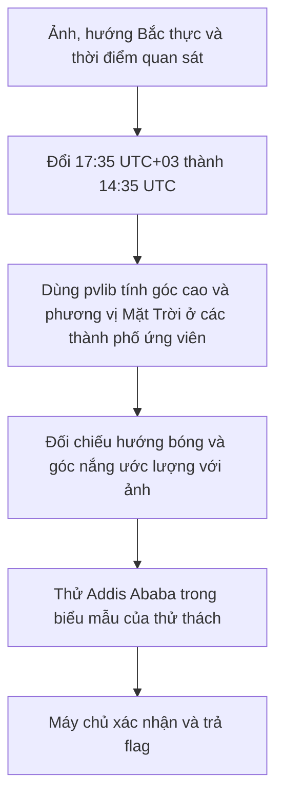
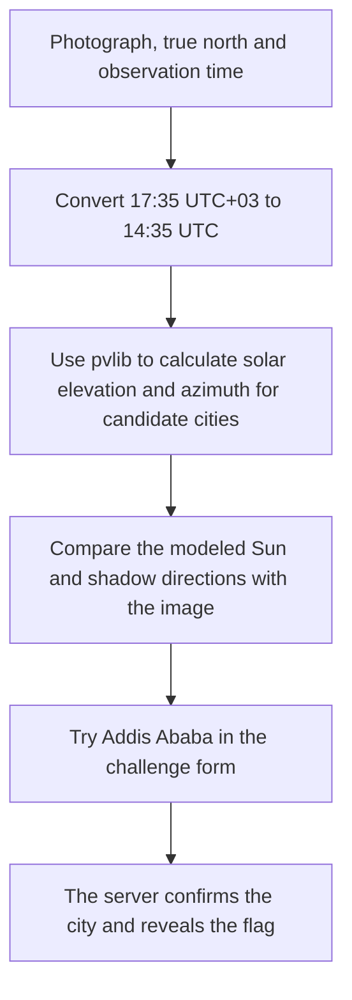

<div class="lang-switch" role="tablist" aria-label="Language switch">
  <button class="lang-btn active" role="tab" type="button" data-lang="en" aria-selected="true">EN</button>
  <button class="lang-btn" role="tab" type="button" data-lang="vn" aria-selected="false">VN</button>
</div>

<div class="lang-vn" markdown="1">

Thử thách **Where the Light Fails to Fall** thuộc mảng OSINT của [Pointer Overflow CTF 2026](https://pointeroverflowctf.com/) (400 điểm, Wave 1). Ta cần tìm thành phố từ ảnh một chú chim bồ câu trên nền đá lát, hướng **Bắc thực** được đánh dấu màu đỏ, các bóng đổ và thời điểm quan sát **28/07/2026, 17:35 UTC+03:00**.

---

## Sơ đồ luồng khai thác (Solve Flow)



---

## Bước 1: Khảo sát đề bài và dữ liệu quan sát

Đề bài cho một ảnh chụp từ trên xuống: chú chim bồ câu **Sir Marcus Skuttlebanks** đứng trên đá lát, một mũi tên đỏ chữ `N` chỉ Bắc thực, và bóng của chim cùng các vật nhỏ trên mặt đất. Đây là hai loại dữ kiện khác nhau: mũi tên giúp định hướng ảnh; bóng đổ giúp ước lượng phương vị Mặt Trời. Mốc thời gian của đội là:

$$17{:}35\ (\mathrm{UTC}+03{:}00) = 14{:}35\ \mathrm{UTC}.$$

Không thể lấy vài tọa độ pixel rồi suy ra chính xác góc cao Mặt Trời nếu chưa biết chiều cao vật, vị trí chân chim và phối cảnh máy ảnh. Vì vậy, các bóng dài trong ảnh chỉ dùng để **lọc ứng viên**; đáp án cuối cùng cần được kiểm chứng bằng biểu mẫu của thử thách.

---

## Bước 2: So sánh vị trí Mặt Trời

Với mỗi thành phố ứng viên, dùng `pvlib` tính góc cao biểu kiến (`apparent_elevation`) và phương vị Mặt Trời (`azimuth`) tại **14:35 UTC**. Phương vị bóng trên mặt đất ngược với phương vị Mặt Trời:

$$\alpha_{\text{bóng}} = (\alpha_{\text{Mặt Trời}} + 180^\circ)\bmod 360^\circ.$$

Đoạn mã sau tái tạo phép so sánh cho các thành phố được nêu trong bản giải:

```python
import pandas as pd
import pvlib

when = pd.Timestamp("2026-07-28 14:35:00", tz="UTC")
cities = {
    "Athens": (37.9838, 23.7275),
    "Istanbul": (41.0082, 28.9784),
    "Cairo": (30.0444, 31.2357),
    "Baghdad": (33.3152, 44.3661),
    "Riyadh": (24.7136, 46.6753),
    "Addis Ababa": (9.03, 38.74),
}

for city, (latitude, longitude) in cities.items():
    sun = pvlib.solarposition.get_solarposition(when, latitude, longitude).iloc[0]
    elevation = sun["apparent_elevation"]
    sun_azimuth = sun["azimuth"]
    shadow_azimuth = (sun_azimuth + 180) % 360
    print(f"{city:12} {elevation:6.2f}° {sun_azimuth:6.2f}° {shadow_azimuth:6.2f}°")
```

Theo thứ tự **thành phố — góc cao — phương vị Mặt Trời — phương vị bóng**, kết quả là:

```text
Athens        34.25° 268.02°  88.02°
Istanbul      30.14° 269.51°  89.51°
Cairo         27.69° 276.83°  96.83°
Baghdad       17.20° 281.68° 101.68°
Riyadh        13.26° 284.95° 104.95°
Addis Ababa   16.26° 287.16° 107.16°
```

Các thành phố châu Âu trong bảng có Mặt Trời cao hơn đáng kể. **Addis Ababa** cho góc cao khoảng **16,26°** và bóng hướng khoảng **107,16°** tính từ Bắc thực, phù hợp với hướng giải từ ảnh. Tuy nhiên, Baghdad và Riyadh cũng có góc nắng thấp; chỉ các con số này chưa đủ chứng minh Addis Ababa là nghiệm duy nhất.

---

## Bước 3: Xác nhận thành phố và lấy flag

Điền `Addis Ababa` vào ô **YOUR ANSWER (CITY NAME)**. Theo phản hồi được ghi lại trong bản giải gốc, máy chủ xác nhận thành phố và trả về:

```json
{
  "correct": true,
  "message": "Flag revealed for your team. Submit it below.",
  "flag": "POCTF{99.623.3YOADRV22RFD27OD.DSGJUSWQHG734ELY3KPFEDNF4F}"
}
```

Sau đó nộp flag vào ô **SUBMIT FLAG** để ghi nhận bài giải. Phản hồi của máy chủ là bước xác nhận đáp án; phân tích bóng và phép tính thiên văn giúp tìm ứng viên hợp lý trước khi thử.

⇒ **Flag:** `POCTF{99.623.3YOADRV22RFD27OD.DSGJUSWQHG734ELY3KPFEDNF4F}`

</div>

<div class="lang-en" markdown="1">

**Where the Light Fails to Fall** is a 400-point, Wave 1 OSINT challenge from [Pointer Overflow CTF 2026](https://pointeroverflowctf.com/). The task is to identify a city from a photograph of a pigeon on paving stones, a red **true-north** marker, the shadows, and an observation time of **July 28, 2026, 17:35 UTC+03:00**.

---

## Solve Flow



---

## Step 1: Read the photograph

The challenge shows **Sir Marcus Skuttlebanks**, a pigeon photographed from above on paving stones. A red `N` arrow indicates true north, while the bird and nearby objects cast shadows. The arrow orients the image; the shadows give an approximate solar bearing. The team's observation time converts to:

$$17{:}35\ (\mathrm{UTC}+03{:}00) = 14{:}35\ \mathrm{UTC}.$$

A few pixel coordinates alone cannot give an accurate solar elevation without the object's height, the bird's ground contact point, and camera perspective. The long shadows therefore serve as a **candidate filter**. The challenge form provides the final check.

---

## Step 2: Compare solar positions

For each candidate city, `pvlib` calculates apparent solar elevation (`apparent_elevation`) and solar azimuth (`azimuth`) at **14:35 UTC**. On level ground, the shadow bearing is opposite the Sun's bearing:

$$\alpha_{\text{shadow}} = (\alpha_{\text{Sun}} + 180^\circ)\bmod 360^\circ.$$

This script reproduces the comparison for the cities discussed in the original writeup:

```python
import pandas as pd
import pvlib

when = pd.Timestamp("2026-07-28 14:35:00", tz="UTC")
cities = {
    "Athens": (37.9838, 23.7275),
    "Istanbul": (41.0082, 28.9784),
    "Cairo": (30.0444, 31.2357),
    "Baghdad": (33.3152, 44.3661),
    "Riyadh": (24.7136, 46.6753),
    "Addis Ababa": (9.03, 38.74),
}

for city, (latitude, longitude) in cities.items():
    sun = pvlib.solarposition.get_solarposition(when, latitude, longitude).iloc[0]
    elevation = sun["apparent_elevation"]
    sun_azimuth = sun["azimuth"]
    shadow_azimuth = (sun_azimuth + 180) % 360
    print(f"{city:12} {elevation:6.2f}° {sun_azimuth:6.2f}° {shadow_azimuth:6.2f}°")
```

In **city — elevation — Sun azimuth — shadow azimuth** order, the output is:

```text
Athens        34.25° 268.02°  88.02°
Istanbul      30.14° 269.51°  89.51°
Cairo         27.69° 276.83°  96.83°
Baghdad       17.20° 281.68° 101.68°
Riyadh        13.26° 284.95° 104.95°
Addis Ababa   16.26° 287.16° 107.16°
```

The European cities in this table have substantially higher solar elevations. **Addis Ababa** has an elevation of about **16.26°** and a shadow bearing of about **107.16°** clockwise from true north, making it a plausible match for the photograph. Baghdad and Riyadh also have low Sun angles, however, so these figures alone do not prove that Addis Ababa is the only possible city.

---

## Step 3: Confirm the city and obtain the flag

Enter `Addis Ababa` in **YOUR ANSWER (CITY NAME)**. According to the response recorded in the supplied writeup, the server confirms the answer and returns:

```json
{
  "correct": true,
  "message": "Flag revealed for your team. Submit it below.",
  "flag": "POCTF{99.623.3YOADRV22RFD27OD.DSGJUSWQHG734ELY3KPFEDNF4F}"
}
```

Submit that value in **SUBMIT FLAG** to record the solve. The server response establishes the correct answer; shadow analysis and the solar model narrow the search to a reasonable candidate first.

⇒ **Flag:** `POCTF{99.623.3YOADRV22RFD27OD.DSGJUSWQHG734ELY3KPFEDNF4F}`

</div>
