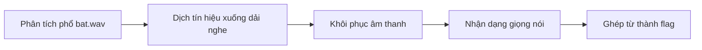
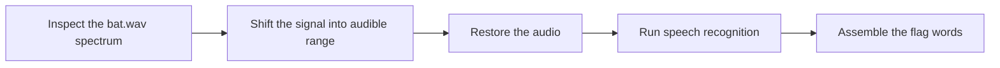

  <button class="lang-btn active" role="tab" type="button" data-lang="en" aria-selected="true">EN</button>
  <button class="lang-btn" role="tab" type="button" data-lang="vn" aria-selected="false">VN</button>

## Đề bài

Tệp bat.wav dài khoảng bốn giây chứa tiếng nói bị dịch lên vùng gần 20 kHz, nên nghe trực tiếp không rõ.

## Cách giải

Phân tích phổ rồi dịch tần xuống dải nghe được, lưu âm thanh phục hồi và đối chiếu kết quả nhận dạng. Ba lượt nhận dạng đều đọc cùng ba từ “lark pepsi shed”.

⇒ **Flag:** `cdctf{lark pepsi shed}`

## Challenge

The roughly four-second bat.wav recording carries speech shifted near 20 kHz, making direct playback unintelligible.

## Solution

Inspect the spectrum, shift the signal back into the audible band, save the recovered audio, and compare independent transcriptions. Three recognition passes agree on “lark pepsi shed”.

⇒ **Flag:** `cdctf{lark pepsi shed}`

