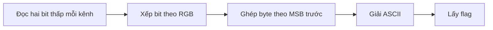
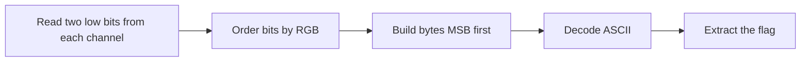

  <button class="lang-btn active" role="tab" type="button" data-lang="en" aria-selected="true">EN</button>
  <button class="lang-btn" role="tab" type="button" data-lang="vn" aria-selected="false">VN</button>

## Đề bài

Ảnh buckethead_zombie.png không chứa dữ liệu nối thêm hay metadata đáng chú ý. Kiểm tra các bit thấp của từng kênh màu để tìm thông điệp.

## Cách giải

Lấy hai bit thấp mỗi kênh theo thứ tự RGB, đọc bit 1 trước bit 0, rồi ghép các bit thành byte theo thứ tự bit cao trước. Dữ liệu ASCII giải ra flag, cần giữ nguyên dấu cách và chữ hoa.

⇒ **Flag:** `cdctf{I l1k3 bUCk375}`

## Challenge

The buckethead_zombie.png image has no meaningful appended data or metadata. Inspect the low bits of each color channel instead.

## Solution

Extract the two least significant bits of each RGB channel, reading bit 1 before bit 0, then assemble bytes most significant bit first. The resulting ASCII is the flag, including its space and capitalization.

⇒ **Flag:** `cdctf{I l1k3 bUCk375}`

