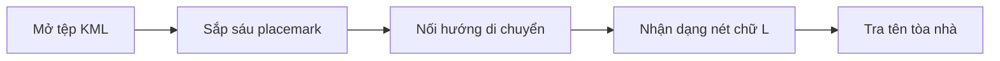
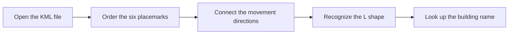

  <button class="lang-btn active" role="tab" type="button" data-lang="en" aria-selected="true">EN</button>
  <button class="lang-btn" role="tab" type="button" data-lang="vn" aria-selected="false">VN</button>

## Đề bài

Mở tệp KML, sắp sáu placemark theo thứ tự: Bryant-Denny Stadium, Rose Administration Building, Denny Chimes, Gorgas Library, Clark Hall và John H. England Jr. Hall.

## Cách giải

Các điểm đi về phía đông rồi rẽ lên phía bắc trong khuôn viên University of Alabama, tạo nét chữ L. Theo tiếp trục này đến cơ sở sinh hoạt sinh viên gần sông và dùng chính xác tên trên mặt tiền tòa nhà.

⇒ **Flag:** `cdctf{Robert E. Witt Student Activity Center}`

## Challenge

Read the KML placemarks in order: Bryant-Denny Stadium, Rose Administration Building, Denny Chimes, Gorgas Library, Clark Hall, and John H. England Jr. Hall.

## Solution

The route moves east and then north through the University of Alabama campus, drawing a large L. Continue along that axis toward the student activity facility by the river and use the exact name on its facade.

⇒ **Flag:** `cdctf{Robert E. Witt Student Activity Center}`

