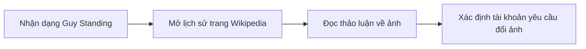
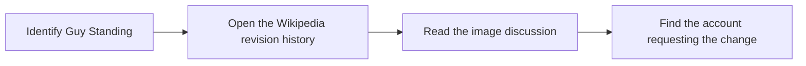

  <button class="lang-btn active" role="tab" type="button" data-lang="en" aria-selected="true">EN</button>
  <button class="lang-btn" role="tab" type="button" data-lang="vn" aria-selected="false">VN</button>

## Đề bài

Bài thơ gợi tới Guy Standing và ảnh trên Wikipedia. Xem lịch sử trang cùng các thảo luận về ảnh để tìm người yêu cầu thay ảnh.

## Cách giải

Trong bản sửa ngày 17/10/2023, tài khoản Geneva2009 tự nhận là vợ của Guy Standing và đề nghị bỏ ảnh gây hiểu lầm. Tên tài khoản với chữ G viết hoa là đáp án.

⇒ **Flag:** `cdctf{Geneva2009}`

## Challenge

The poem points to Guy Standing and his Wikipedia photo. Inspect the page history and image discussions to identify who requested a change.

## Solution

In the 17 October 2023 edit, account Geneva2009 identifies herself as Guy Standing’s wife and asks to remove the misleading image. The username, with an uppercase G, is the answer.

⇒ **Flag:** `cdctf{Geneva2009}`

