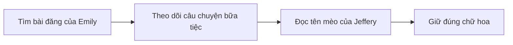
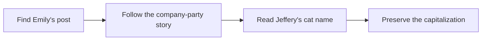

  <button class="lang-btn active" role="tab" type="button" data-lang="en" aria-selected="true">EN</button>
  <button class="lang-btn" role="tab" type="button" data-lang="vn" aria-selected="false">VN</button>

## Đề bài

Tìm bài đăng của Emily Peterson về bữa tiệc Giáng sinh công ty. Bài viết nói rõ cô gặp mèo của sếp Jeffery Barrett tại sự kiện này.

## Cách giải

Tên con mèo xuất hiện nguyên văn trong phần chú thích bài đăng: Bubba. Giữ đúng chữ hoa đầu tên theo định dạng đề.

⇒ **Flag:** `cdctf{Bubba}`

## Challenge

Find Emily Peterson’s post about the company Christmas party. It says she met her boss Jeffery Barrett’s cat there.

## Solution

The post explicitly names the cat Bubba. Preserve the initial capital letter in the challenge’s requested format.

⇒ **Flag:** `cdctf{Bubba}`

