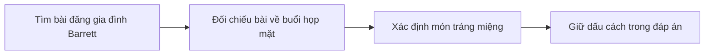
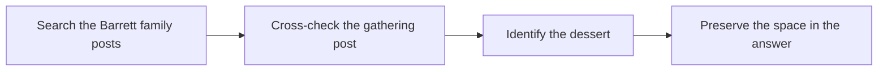

  <button class="lang-btn active" role="tab" type="button" data-lang="en" aria-selected="true">EN</button>
  <button class="lang-btn" role="tab" type="button" data-lang="vn" aria-selected="false">VN</button>

## Đề bài

Đề hỏi món tráng miệng nổi tiếng của Maryanne Barrett. Tìm các bài đăng liên quan gia đình Barrett và bữa tiệc của trường trên Crimson Social.

## Cách giải

Một bài viết cảm ơn mẹ của Mrs. Barrett-Reynolds mang món peach cobbler tới buổi họp mặt; bài của Brandon Barrett cũng nhắc món mẹ thường làm. Dùng tên món với dấu cách như cú pháp mẫu.

⇒ **Flag:** `cdctf{peach cobbler}`

## Challenge

The challenge asks for Maryanne Barrett’s signature dessert. Search Crimson Social posts about the Barrett family and a school gathering.

## Solution

A post thanks Mrs. Barrett-Reynolds’s mother for bringing peach cobbler; Brandon Barrett also mentions his mother’s usual dessert. Use the dish name with a space, matching the prompt’s format.

⇒ **Flag:** `cdctf{peach cobbler}`

