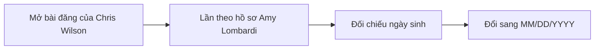
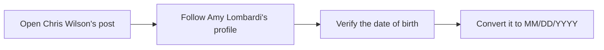

  <button class="lang-btn active" role="tab" type="button" data-lang="en" aria-selected="true">EN</button>
  <button class="lang-btn" role="tab" type="button" data-lang="vn" aria-selected="false">VN</button>

## Đề bài

Từ bài đăng của Dr. Chris Wilson về cuộc ly hôn, lần theo hồ sơ người vợ cũ Amy Lombardi. Cần phân biệt Amy với người dùng khác cũng nhắc đến chồng cũ tên C.

## Cách giải

Đối chiếu chuỗi bài đăng gia đình và ngày sinh của Amy, kết quả là 11/07/1981 theo cách viết ngày/tháng. Đề dùng mẫu MM/DD/YYYY, nên đưa tháng trước ngày.

⇒ **Flag:** `cdctf{07/11/1981}`

## Challenge

Follow Dr. Chris Wilson’s divorce posts to his former wife Amy Lombardi. Distinguish her from another user who also mentions an ex-husband whose name begins with C.

## Solution

Cross-check the family timeline and Amy’s birthday, 11 July 1981. The challenge requires MM/DD/YYYY, so write the month before the day.

⇒ **Flag:** `cdctf{07/11/1981}`

