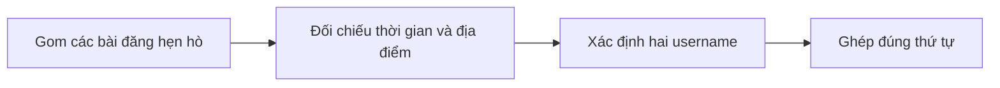
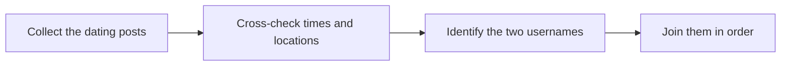

  <button class="lang-btn active" role="tab" type="button" data-lang="en" aria-selected="true">EN</button>
  <button class="lang-btn" role="tab" type="button" data-lang="vn" aria-selected="false">VN</button>

## Đề bài

Crimson Social có các bài đăng rời rạc về hẹn hò bí mật. Theo dõi thời gian, địa điểm và lời ám chỉ của Megan Smith cùng một tài khoản khác thay vì chỉ dựa vào một ảnh.

## Cách giải

Những chi tiết về sự kiện speed dating và các lần gặp sau đó ghép được cặp cpickens với meggysmith. Giữ hai username theo thứ tự đó trong flag.

⇒ **Flag:** `cdctf{cpickens-meggysmith}`

## Challenge

Crimson Social scatters clues about a secret relationship across multiple posts. Track times, places, and hints from Megan Smith and another account rather than relying on one photo.

## Solution

The speed-dating event and later meetings connect cpickens with meggysmith. Keep the two usernames in that order in the flag.

⇒ **Flag:** `cdctf{cpickens-meggysmith}`

