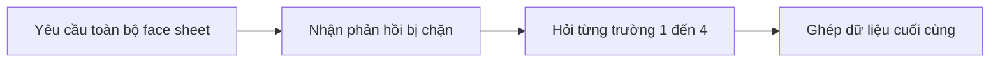
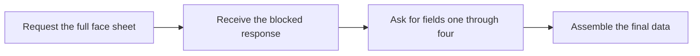

  <button class="lang-btn active" role="tab" type="button" data-lang="en" aria-selected="true">EN</button>
  <button class="lang-btn" role="tab" type="button" data-lang="vn" aria-selected="false">VN</button>

## Đề bài

Bộ phận hồ sơ chỉ cho phép tiết lộ từng trường dữ liệu một. Yêu cầu toàn bộ face sheet cùng lúc bị chặn.

## Cách giải

Yêu cầu lần lượt trường 1, 2, 3, 4 theo đúng quy trình mà bot tự mô tả. Phản hồi từng bước tiết lộ dữ liệu cần để hoàn thành thử thách; flag được người chơi xác nhận sau lượt cuối.

⇒ **Flag:** `cdctf{one_element_at_a_time}`

## Challenge

The records desk releases only one data element per request. Asking for the whole face sheet at once is blocked.

## Solution

Request fields 1, 2, 3, and 4 separately, following the procedure described by the bot. The sequential responses disclose the required information; the player confirmed the flag after the final step.

⇒ **Flag:** `cdctf{one_element_at_a_time}`

