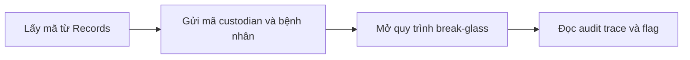
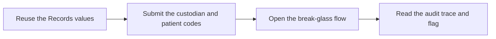

  <button class="lang-btn active" role="tab" type="button" data-lang="en" aria-selected="true">EN</button>
  <button class="lang-btn" role="tab" type="button" data-lang="vn" aria-selected="false">VN</button>

## Đề bài

Daemon lưu trữ từ chối phiên chưa xác thực. Những trường lấy được từ thử thách Records cung cấp mã ủy quyền custodian và mã bệnh nhân để mở quy trình break-glass.

## Cách giải

Đưa mã ủy quyền và mã bệnh nhân vào yêu cầu xác thực, sau đó yêu cầu bản ghi được phép truy cập. Bot trả về dấu vết kiểm toán của thao tác break-glass cùng flag; người chơi đã đối chiếu và xác nhận.

⇒ **Flag:** `cdctf{break_glass_leaves_a_record}`

## Challenge

The records custodian daemon rejects unauthenticated sessions. Fields obtained from the Records challenge provide a custodian authorization and patient identifier for its break-glass workflow.

## Solution

Provide both identifiers in the authorization request, then ask for the permitted record. The bot returns the break-glass audit trail and flag; the player confirmed the result.

⇒ **Flag:** `cdctf{break_glass_leaves_a_record}`

