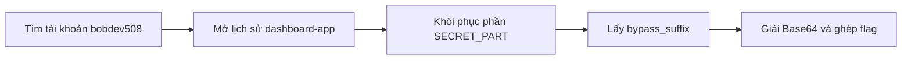
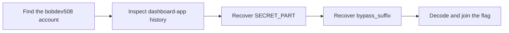

  <button class="lang-btn active" role="tab" type="button" data-lang="en" aria-selected="true">EN</button>
  <button class="lang-btn" role="tab" type="button" data-lang="vn" aria-selected="false">VN</button>

## Đề bài

Manh mối dẫn tới tài khoản GitHub bobdev508. Kho decoy-project chỉ chứa flag mồi; phần cần tìm nằm ở hai vị trí trong lịch sử dashboard-app.

## Cách giải

Xem mọi commit bằng `git log -p --all`. Commit be82c694 từng đưa `.env.local` lên kho rồi xóa, nhưng diff vẫn giữ `SECRET_PART=Q1NTQ1RGe3VfZzA=`. Giải Base64 được nửa đầu `CSSCTF{u_g0`.

Commit b72b7ffa sửa ghi chú xác thực, trong đó `auth_notes.md` chứa `bypass_suffix = "t_130d_508}"`. Ghép hai phần theo đúng thứ tự.

⇒ **Flag:** `CSSCTF{u_g0t_130d_508}`

## Challenge

The clue leads to GitHub account bobdev508. The decoy-project repository only contains fake flags; the two needed pieces reside in dashboard-app history.

## Solution

Inspect every commit with `git log -p --all`. Commit be82c694 briefly added `.env.local` and then removed it, but the diff preserves `SECRET_PART=Q1NTQ1RGe3VfZzA=`. Base64 decoding gives the first half, `CSSCTF{u_g0`.

Commit b72b7ffa changed authentication notes. Its `auth_notes.md` contains `bypass_suffix = "t_130d_508}"`. Concatenate the pieces in that order.

⇒ **Flag:** `CSSCTF{u_g0t_130d_508}`

