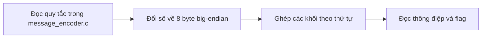
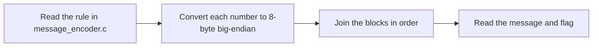

  <button class="lang-btn active" role="tab" type="button" data-lang="en" aria-selected="true">EN</button>
  <button class="lang-btn" role="tab" type="button" data-lang="vn" aria-selected="false">VN</button>

## Đề bài

Tệp message_encoder.c biến thông điệp thành các số lớn. Đọc lại chiều chuyển đổi để biết từng số biểu diễn một khối tám byte.

## Cách giải

Chuyển từng số về tám byte big-endian rồi ghép theo thứ tự ban đầu. Bản rõ hẹn gặp tại Tom Bevill Building vào trưa thứ Năm tuần sau; mã hóa ngược xác nhận khớp cả tám số đầu vào.

⇒ **Flag:** `cdctf{Tom_Bevill_Building_at_noon_next_week_Thursday}`

## Challenge

The message_encoder.c file turns a message into large integers. Reverse its conversion to see that each integer represents an eight-byte block.

## Solution

Convert every integer to eight big-endian bytes and concatenate the blocks in order. The plaintext names Tom Bevill Building at noon next Thursday; encoding it again matches all eight input integers.

⇒ **Flag:** `cdctf{Tom_Bevill_Building_at_noon_next_week_Thursday}`

