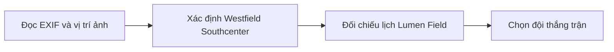
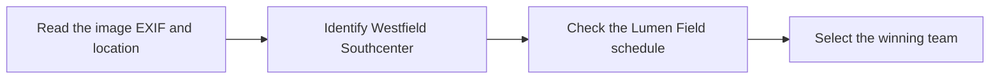

  <button class="lang-btn active" role="tab" type="button" data-lang="en" aria-selected="true">EN</button>
  <button class="lang-btn" role="tab" type="button" data-lang="vn" aria-selected="false">VN</button>

## Đề bài

Ảnh cho thấy người hâm mộ tại Westfield Southcenter gần Seattle. EXIF của hai ảnh ghi 26/06/2026 lúc 16:51; biển mở cửa cửa hàng trong trung tâm thương mại cũng khớp năm 2026.

## Cách giải

Đối chiếu lịch các trận tại Lumen Field: trận Bosnia and Herzegovina gặp Qatar ngày 24/06 đã kết thúc 3–1; trận ngày 26/06 diễn ra sau giờ chụp và hòa. Vì vậy đội thắng trận người hâm mộ vừa xem là Bosnia and Herzegovina.

⇒ **Flag:** `cdctf{Bosnia and Herzegovina}`

## Challenge

The photos place the fan at Westfield Southcenter near Seattle. EXIF on two images records 26 June 2026 at 16:51, and mall opening signs corroborate the year.

## Solution

Compare games at Lumen Field: Bosnia and Herzegovina defeated Qatar 3–1 on 24 June; the 26 June game began after the photo and ended level. The winner of the game the fan had seen is therefore Bosnia and Herzegovina.

⇒ **Flag:** `cdctf{Bosnia and Herzegovina}`

