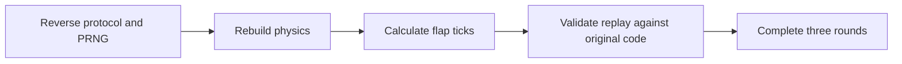

  <button class="lang-btn active" role="tab" type="button" data-lang="en" aria-selected="true">EN</button>
  <button class="lang-btn" role="tab" type="button" data-lang="vn" aria-selected="false">VN</button>

## Bài toán

FLAPPY BOARD yêu cầu điều khiển drone vượt ba chặng trong phiên 20 phút. Client Linux x86-64 trao đổi với dịch vụ qua `/api/attempt` và `/api/complete`; thay vì chơi bằng giao diện, ta có thể khôi phục mô phỏng tất định rồi gửi lịch bấm cánh hợp lệ.

## Khôi phục mô phỏng

`/api/attempt` trả về token, seed, mục tiêu và thời gian chờ. `/api/complete` nhận số vòng, `wait_ms`, số tick, điểm và danh sách tick bấm cánh. Bộ sinh số giả ngẫu nhiên dùng xorshift32. Tọa độ được lưu theo tỉ lệ 256 đơn vị trên mỗi pixel; trọng lực là 67, tốc độ khi bấm cánh là -1724, tốc độ rơi tối đa là 2048 và ống di chuyển 717 đơn vị mỗi tick. Tâm khe ống bằng `125 + rng % 231`, bán chiều cao khe là 87 pixel.

Bộ điều khiển theo dõi ống gần nhất chưa vượt qua và bấm cánh khi chim thấp hơn tâm khe 40 pixel. Để tránh sai khác giữa mô phỏng Python và chương trình, bản tái hiện dùng Unicorn chạy mã khởi tạo và cập nhật gốc, so sánh toàn bộ trạng thái 84 byte sau từng tick.

## Kết quả

Ba replay đạt lần lượt 10, 20 và 30 điểm sau 1.197, 2.161 và 3.125 tick. Dịch vụ chấp nhận cả ba yêu cầu hoàn thành; phản hồi cuối chuyển sang vòng 4 và trả flag.

⇒ **Flag:** `CSSCTF{birdddd}`

## Challenge

FLAPPY BOARD asks us to guide a courier drone through three sectors within a 20-minute session. The Linux x86-64 client talks to `/api/attempt` and `/api/complete`. Instead of playing through the GUI, we can reconstruct its deterministic simulation and submit valid flap schedules.

## Reconstructing the simulation

`/api/attempt` returns a token, seed, target, and wait duration. `/api/complete` takes the round number, `wait_ms`, tick count, score, and flap-tick list. The PRNG is xorshift32. Coordinates use 256 units per pixel; gravity is 67, flap velocity -1724, maximum fall velocity 2048, and pipes move 717 units per tick. Gap centers are `125 + rng % 231`, with an 87-pixel half-height.

The controller follows the closest unpassed pipe and flaps when the bird is 40 pixels below its center. To catch differences between Python and the binary, the reproducer runs original initialization and update code in Unicorn, comparing the full 84-byte state after every tick.

## Result

The three replays reached 10, 20, and 30 points after 1,197, 2,161, and 3,125 ticks. The service accepted all three completion requests; the final response advanced to round 4 and returned the flag.

⇒ **Flag:** `CSSCTF{birdddd}`

