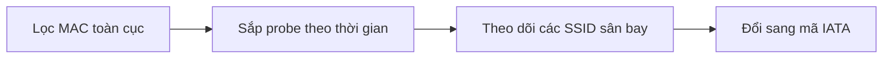
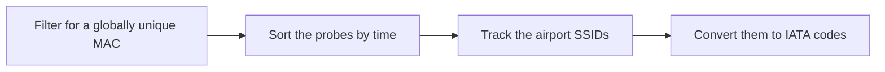

  <button class="lang-btn active" role="tab" type="button" data-lang="en" aria-selected="true">EN</button>
  <button class="lang-btn" role="tab" type="button" data-lang="vn" aria-selected="false">VN</button>

## Đề bài

Cơ sở dữ liệu probe request thu từ rogue access point chứa nhiều thiết bị và SSID. Lọc địa chỉ MAC toàn cục thay vì địa chỉ ngẫu nhiên để theo dõi một thiết bị ổn định.

## Cách giải

MAC 3C:07:54:1D:9B:E2 có bit U/L bằng 0. Sắp probe theo thời gian, các SSID sân bay lần lượt là YVR-Public, NRT-FREE-WiFi, HND-FreeWiFi và SEA-WiFi-Free. Lấy mã sân bay theo đúng thứ tự.

⇒ **Flag:** `cdctf{YVR_NRT_HND_SEA}`

## Challenge

The rogue access point’s probe-request database contains many devices and SSIDs. Filter for a globally administered MAC rather than randomized addresses to track one stable device.

## Solution

MAC 3C:07:54:1D:9B:E2 has its U/L bit clear. In time order, its airport SSIDs are YVR-Public, NRT-FREE-WiFi, HND-FreeWiFi, and SEA-WiFi-Free. Use the airport codes in that order.

⇒ **Flag:** `cdctf{YVR_NRT_HND_SEA}`

