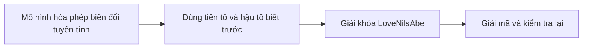
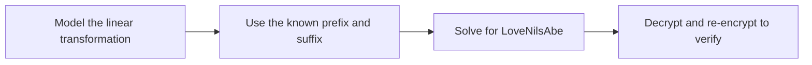

  <button class="lang-btn active" role="tab" type="button" data-lang="en" aria-selected="true">EN</button>
  <button class="lang-btn" role="tab" type="button" data-lang="vn" aria-selected="false">VN</button>

## Đề bài

Mã trong GL2-88.hs dùng ma trận tam giác trên để trộn khóa và sinh keystream. Dù lặp 12 vòng, phép biến đổi vẫn tuyến tính theo khóa.

## Cách giải

Dựng hệ phương trình từ ciphertext cùng tiền tố cdctf{ và dấu đóng ngoặc đã biết. Giải được khóa LoveNilsAbe, giải toàn bộ ciphertext, rồi mã hóa lại để kiểm tra khớp byte với bản gốc.

⇒ **Flag:** `cdctf{TooConfusedlyDiffusedAcrossMyGroup???}`

## Challenge

GL2-88.hs uses upper triangular matrices to mix the key and generate a keystream. Even after twelve rounds, the transform remains linear in the key.

## Solution

Build equations from the ciphertext and known cdctf{ prefix and closing brace. Solving yields key LoveNilsAbe; decrypt the ciphertext and re-encrypt the flag to confirm a byte-for-byte match.

⇒ **Flag:** `cdctf{TooConfusedlyDiffusedAcrossMyGroup???}`

