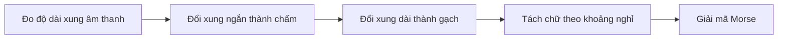
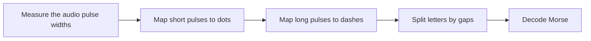

  <button class="lang-btn active" role="tab" type="button" data-lang="en" aria-selected="true">EN</button>
  <button class="lang-btn" role="tab" type="button" data-lang="vn" aria-selected="false">VN</button>

## Đề bài

Tệp âm thanh communiCATions.wav có chuỗi xung ngắn ở một kênh. Quan sát waveform cho thấy độ dài xung và khoảng nghỉ thuộc hai nhóm rõ rệt.

## Cách giải

Biến xung ngắn thành dấu chấm, xung dài thành dấu gạch, và phân tách chữ theo khoảng nghỉ để đọc mã Morse. Mã hóa ngược thông điệp đã đọc tái tạo đúng cả 137 mẫu tín hiệu trong vùng được chọn.

⇒ **Flag:** `cdctf{I WANT TO EAT FISHIES}`

## Challenge

The communiCATions.wav audio contains a short pulse sequence in one channel. The waveform shows two clear pulse lengths and distinct spacing groups.

## Solution

Map short pulses to dots and long pulses to dashes, then split letters using the pauses to read Morse code. Re-encoding the decoded message reproduces all 137 samples in the selected signal region exactly.

⇒ **Flag:** `cdctf{I WANT TO EAT FISHIES}`

