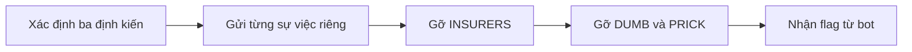
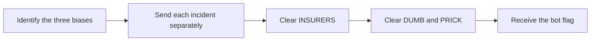

  <button class="lang-btn active" role="tab" type="button" data-lang="en" aria-selected="true">EN</button>
  <button class="lang-btn" role="tab" type="button" data-lang="vn" aria-selected="false">VN</button>

## Đề bài

Sau khi biết người Jeffery ghét là Francis Miller, nhiệm vụ mới yêu cầu thay đổi đánh giá của bot. Cố nhồi ba luận điểm trong một tin khiến cuộc đối thoại rối và còn bị giới hạn độ dài.

## Cách giải

Đưa từng sự việc riêng: Francis xử lý sai sót bảo hiểm, tự tìm nguyên nhân các hồ sơ bị từ chối, rồi cảm ơn và giúp đồng nghiệp hoàn thành ca làm. Khi ba định kiến INSURERS, DUMB và PRICK lần lượt được gỡ, bot trả về flag; người chơi đã xác nhận kết quả.

⇒ **Flag:** `cdctf{th1s_guy_1snt_s0_b@d!}`

## Challenge

After identifying Francis Miller, the sequel asks us to change Jeffery’s opinion of him. Packing three arguments into one message proved unwieldy and exceeded the chat’s practical length.

## Solution

Present one incident at a time: Francis resolves an insurance issue, independently diagnoses denied claims, and thanks and helps a colleague after a long shift. Clearing the INSURERS, DUMB, and PRICK objections in order makes the bot return the flag, which the player confirmed.

⇒ **Flag:** `cdctf{th1s_guy_1snt_s0_b@d!}`

