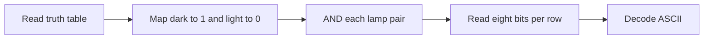

  <button class="lang-btn active" role="tab" type="button" data-lang="en" aria-selected="true">EN</button>
  <button class="lang-btn" role="tab" type="button" data-lang="vn" aria-selected="false">VN</button>

## Đề bài và quan sát

Lamp Drill là bài khởi động về mạch logic. Tệp `lampDrill.svg` chứa bảng chân trị ở đầu và ba hàng đèn ở dưới. Bảng cho thấy cặp đèn tối–tối tạo đầu ra tối, còn mọi cặp có ít nhất một đèn sáng tạo đầu ra sáng. Nếu quy ước tối là `1` và sáng là `0`, mỗi hộp thực hiện phép AND.

## Giải mã

Mỗi hàng có 16 đèn, ghép theo thứ tự trái sang phải thành tám cặp. Tính AND cho từng cặp rồi coi tám bit là một byte ASCII:

| Hàng | Tám bit | Ký tự |
| --- | --- | --- |
| 1 | `01100011` | `c` |
| 2 | `01110011` | `s` |
| 3 | `01110011` | `s` |

Đọc theo chiều từ trên xuống cho ra chuỗi `css`. Bước kiểm tra bằng script đọc màu đèn trực tiếp từ các phần tử `path` trong SVG; dòng chú giải ở phía trên không được tính là dữ liệu.

⇒ **Flag:** `CSSCTF{css}`

## Challenge and observation

Lamp Drill is a logic-circuit warm-up. The supplied `lampDrill.svg` contains a truth table above three rows of lamps. A dark–dark pair yields a dark output, while any pair containing a light lamp yields a light output. Assigning dark = `1` and light = `0` makes each box an AND gate.

## Decoding

Each row has 16 lamps. Pair them from left to right and apply AND to obtain one eight-bit ASCII byte:

| Row | Eight bits | Character |
| --- | --- | --- |
| 1 | `01100011` | `c` |
| 2 | `01110011` | `s` |
| 3 | `01110011` | `s` |

Reading top to bottom gives `css`. A verification script reads lamp colors from SVG `path` elements and excludes the legend row from the data.

⇒ **Flag:** `CSSCTF{css}`

