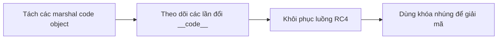
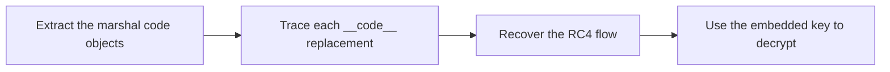

  <button class="lang-btn active" role="tab" type="button" data-lang="en" aria-selected="true">EN</button>
  <button class="lang-btn" role="tab" type="button" data-lang="vn" aria-selected="false">VN</button>

## Đề bài

Tệp Python dùng marshal để giấu code object và thay __code__ của một hàm nhiều lần khi chạy. Vì vậy chỉ đọc mã nguồn bề mặt sẽ bỏ qua logic kiểm tra.

## Cách giải

Tách các code object theo dấu phân cách, phân tích hàm kiểm tra và giải luồng RC4 bằng khóa nhúng trong chương trình. Kết quả có chữ số 0 trong functi0s, đúng theo byte được giải.

⇒ **Flag:** `cdctf{Y_m4ny_functi0s_wh3n_f3w_d0_trick}`

## Challenge

The Python file hides code objects with marshal and repeatedly replaces a function’s __code__ at runtime. Reading only the visible wrapper misses the checker.

## Solution

Split the code objects at the delimiter, inspect the checker, and decrypt its RC4 stream with the embedded key. The decoded word functi0s contains a zero, as in the recovered bytes.

⇒ **Flag:** `cdctf{Y_m4ny_functi0s_wh3n_f3w_d0_trick}`

