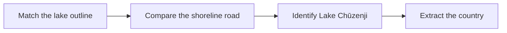

  <button class="lang-btn active" role="tab" type="button" data-lang="en" aria-selected="true">EN</button>
  <button class="lang-btn" role="tab" type="button" data-lang="vn" aria-selected="false">VN</button>

## Đề bài

Ảnh bản đồ đã ẩn nhãn địa danh. So đường viền hồ và con đường chạy sát bờ phía bắc với dữ liệu bản đồ thay vì đoán quốc gia từ màu nền.

## Cách giải

Hình dạng khớp hồ Chūzenji ở Nikkō, gồm cả đường ven bờ phía bắc. Đề yêu cầu tên quốc gia của hồ, nên trả lời Japan.

⇒ **Flag:** `cdctf{Japan}`

## Challenge

The map image removes place labels. Compare the shoreline and the road along its northern edge against map data instead of guessing from colors.

## Solution

The shape matches Lake Chūzenji in Nikkō, including the northern lakeside road. The prompt asks for the country, so the answer is Japan.

⇒ **Flag:** `cdctf{Japan}`

