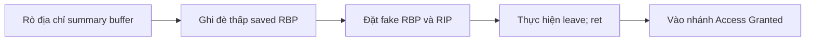
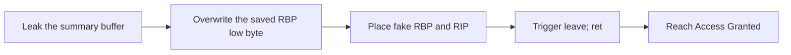

  <button class="lang-btn active" role="tab" type="button" data-lang="en" aria-selected="true">EN</button>
  <button class="lang-btn" role="tab" type="button" data-lang="vn" aria-selected="false">VN</button>

## Đề bài

Dịch vụ báo cáo bảo trì in địa chỉ vùng nhớ của bản tóm tắt và cho nhập nhãn operator. Mục tiêu là đi tới nhánh cấp quyền vốn không được gọi trong luồng bình thường.

## Cách giải

Hàm báo cáo rò địa chỉ buffer 80 byte. Hàm gắn nhãn tiếp theo đọc 33 byte vào buffer 32 byte, nên byte cuối ghi đè byte thấp của saved RBP. Dùng địa chỉ rò để chọn vị trí pivot nằm trong bản tóm tắt mình đã điền.

Đặt fake RBP và địa chỉ nhánh Access Granted tại vị trí đó. Khi hàm báo cáo chạy `leave; ret`, nó lấy cặp RBP/RIP do mình kiểm soát và bỏ qua phép so token. Bộ khai thác cục bộ kiểm tra căn chỉnh stack, chạy ổn định ba lần trên dịch vụ thật và thu flag.

⇒ **Flag:** `CSSCTF{Duh_m4t3_1_4m_sl33py}`

## Challenge

The maintenance report service prints the address of its summary buffer and accepts an operator tag. The goal is to reach an authorization branch that normal execution never calls.

## Solution

The report function leaks its 80-byte buffer address. The tag function then reads 33 bytes into a 32-byte buffer, letting the final byte overwrite the low byte of the saved RBP. Use the leak to select a reachable pivot slot inside the controlled summary.

Place a fake RBP and the Access Granted branch address there. When the report function executes `leave; ret`, it pops the controlled RBP/RIP pair and skips the token check. The local exploit checks stack alignment, worked three times against the service, and captured the flag.

⇒ **Flag:** `CSSCTF{Duh_m4t3_1_4m_sl33py}`

