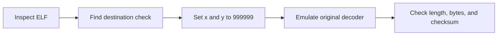

  <button class="lang-btn active" role="tab" type="button" data-lang="en" aria-selected="true">EN</button>
  <button class="lang-btn" role="tab" type="button" data-lang="vn" aria-selected="false">VN</button>

## Mục tiêu

Trong mô phỏng hành tinh, nhân vật bắt đầu ở `(1, 1)` còn trạm đích ở `(999999, 999999)`. Việc di chuyển thủ công không cần thiết để hiểu điều kiện thắng: tệp ELF x86-64 gọi hàm giải mã flag khi cả hai tọa độ đạt giá trị đích.

## Phân tích và tái hiện

Trong tệp gốc có SHA-256 `2d0c95f718b84f07d94173def6753a105260a8d1a46e92cac9d8352e84ee5812`, hai tọa độ 32-bit nằm tại `0x17010` và `0x17014`. Hàm tại `0x29ca` kiểm tra đích; nhánh hiển thị gọi bộ giải mã tại `0x2c52` sau khi người chơi trả lời hội thoại.

Script tái hiện nạp các đoạn ELF vào Unicorn, gán `x = 999999` và `y = 999999` rồi gọi chính hàm `0x2c52`. Nó mô phỏng lời gọi ngoài `memcpy`, còn 8.320 cặp lệnh VM, dữ liệu mã hóa và kiểm tra nội bộ vẫn là mã gốc. Hàm trả về `1` sau khi xác minh độ dài, ký tự in được và checksum FNV-1a của chuỗi giải mã.

⇒ **Flag:** `CSSCTF{P12INC3_0R_P1NC3?}`

## Objective

In this planetary simulation, the avatar starts at `(1, 1)` while the beacon is at `(999999, 999999)`. Manual travel is unnecessary for understanding the win condition: the x86-64 ELF calls its flag decoder when both coordinates reach the destination.

## Analysis and reproduction

The original file has SHA-256 `2d0c95f718b84f07d94173def6753a105260a8d1a46e92cac9d8352e84ee5812`. Two 32-bit coordinate globals live at `0x17010` and `0x17014`. Function `0x29ca` detects arrival; the display path calls decoder `0x2c52` after a dialogue reply.

The reproducer maps ELF segments in Unicorn, sets `x = 999999` and `y = 999999`, then invokes the original `0x2c52` function. It models the external `memcpy` call; all 8,320 shuffled VM instruction pairs, encrypted data, and internal validation remain original. The function returns `1` after checking decoded length, printable bytes, and the FNV-1a checksum.

⇒ **Flag:** `CSSCTF{P12INC3_0R_P1NC3?}`

