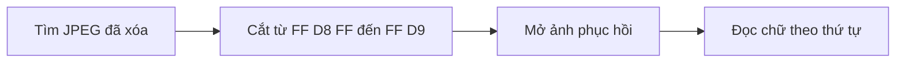
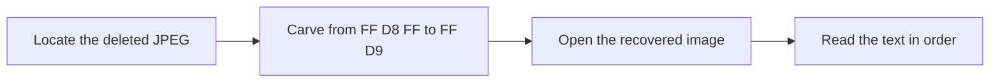

  <button class="lang-btn active" role="tab" type="button" data-lang="en" aria-selected="true">EN</button>
  <button class="lang-btn" role="tab" type="button" data-lang="vn" aria-selected="false">VN</button>

## Đề bài

Ảnh hệ thống tệp 32 MiB vẫn chứa JPEG đã xóa. Tìm marker bắt đầu FF D8 FF tại offset 8652800 và marker kết thúc FF D9 tại 8992194.

## Cách giải

Cắt cả hai marker thu được JPEG 339.396 byte, giải mã thành ảnh 1197 × 900. Đọc chữ xanh theo thứ tự từ trên xuống: tiền tố, “riggity”, “_rich”, “_rat” và dấu đóng ngoặc. Từ đầu có hai chữ g liên tiếp.

⇒ **Flag:** `cdctf{riggity_rich_rat}`

## Challenge

The 32 MiB filesystem image still contains the deleted JPEG. Locate the FF D8 FF start marker at offset 8652800 and the FF D9 end marker at 8992194.

## Solution

Carving the inclusive range produces a 339,396-byte, 1197 × 900 JPEG. Read the green handwriting from top to bottom: the prefix, “riggity”, “_rich”, “_rat”, and the closing brace. The first word has two consecutive g letters.

⇒ **Flag:** `cdctf{riggity_rich_rat}`

