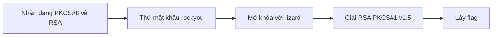
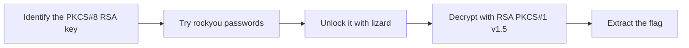

  <button class="lang-btn active" role="tab" type="button" data-lang="en" aria-selected="true">EN</button>
  <button class="lang-btn" role="tab" type="button" data-lang="vn" aria-selected="false">VN</button>

## Đề bài

Bài cho khóa riêng RSA-4096 được bọc bằng PKCS#8 có mật khẩu và tệp flag.txt.enc dài 512 byte. Gợi ý “ROCKS” dẫn đến những mật khẩu phổ biến đầu danh sách rockyou.

## Cách giải

Thử từng mật khẩu để mở khóa PEM; “lizard” ở dòng 1889 thành công. Dùng khóa riêng giải bản mã RSA với PKCS#1 v1.5 cho ra flag. Thử OAEP không phù hợp, giúp xác nhận đúng padding.

⇒ **Flag:** `cdctf{diggity_encryption_stuff_and_all_that}`

## Challenge

The challenge supplies a password-protected PKCS#8 RSA-4096 private key and a 512-byte flag.txt.enc file. The “ROCKS” clue points to common entries near the start of rockyou.

## Solution

Try candidate passwords against the PEM; “lizard” at line 1889 unlocks it. Decrypt the RSA ciphertext with PKCS#1 v1.5 to recover the flag. OAEP fails, confirming the padding choice.

⇒ **Flag:** `cdctf{diggity_encryption_stuff_and_all_that}`

