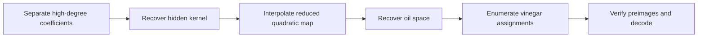

  <button class="lang-btn active" role="tab" type="button" data-lang="en" aria-selected="true">EN</button>
  <button class="lang-btn" role="tab" type="button" data-lang="vn" aria-selected="false">VN</button>

## Dữ liệu đầu vào

`source.py` tạo khóa công khai từ một ánh xạ tam giác bị ngụy trang rồi ghép với ánh xạ oil-vinegar trên trường `F17`. Khóa công khai gồm 34 đa thức theo 32 biến, bậc không quá bốn. Ta có ba khối bản mã nhưng không có khóa riêng.

## Khôi phục cấu trúc ẩn

Ma trận hệ số của các hạng bậc ba và bốn có hạng 18. Không gian hạt nhân trái của nó cho 16 tổ hợp đầu ra bậc hai. Hessian của các tổ hợp này có chung một hạt nhân 16 chiều, chính là các tọa độ chỉ xuất hiện tuyến tính trong tầng tam giác.

Chọn phần bù của hạt nhân đó. Với mỗi khối mã, 16 phương trình đã lộ diễn tả các tọa độ thuộc hạt nhân như hàm bậc hai của 16 tọa độ còn lại. Thay vào khóa công khai và nội suy tại gốc, các vector đơn vị dương/âm và tổng từng cặp để có hệ bậc hai rút gọn.

Hessian của hệ rút gọn có hạng tám; các hạt nhân riêng trải ra không gian oil 12 chiều. Bốn tọa độ còn lại là vinegar. Duyệt `17^4 = 83521` cấu hình vinegar, giải hệ tuyến tính theo 12 biến oil rồi kiểm tra lại toàn bộ 34 đa thức gốc. Mỗi khối mã có đúng một tiền ảnh phù hợp. Giải khung byte base-17 big-endian và kiểm tra độ dài cùng byte đệm bằng không.

⇒ **Flag:** `CSSCTF{P35T0_5CH3M3_4TT4CK2026}`

## Inputs

`source.py` constructs the public key from a disguised triangular map composed with an oil-vinegar map over `F17`. The public key has 34 polynomials in 32 variables, of degree at most four. We have three ciphertext blocks and no private key.

## Recovering the hidden structure

The coefficient matrix of cubic and quartic terms has rank 18. Its left kernel reveals 16 quadratic combinations of public outputs. Their Hessians share a 16-dimensional kernel: the coordinates entering the triangular stage only linearly.

Choose a complementary basis. For each ciphertext block, those 16 equations express the kernel coordinates as quadratic functions of the 16 remaining coordinates. Substitute into the public map and interpolate at zero, positive/negative basis vectors, and pairwise sums to recover the reduced quadratic system.

The reduced Hessians have rank eight; their individual kernels span a 12-dimensional oil space. Four remaining coordinates are vinegar variables. Enumerate `17^4 = 83521` vinegar assignments, solve the resulting linear system in 12 oil variables, and check every recovered preimage against all 34 original public polynomials. Each ciphertext block has exactly one valid preimage. Decode the big-endian base-17 byte frame and verify its length and zero padding.

⇒ **Flag:** `CSSCTF{P35T0_5CH3M3_4TT4CK2026}`

