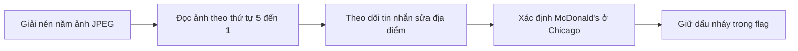
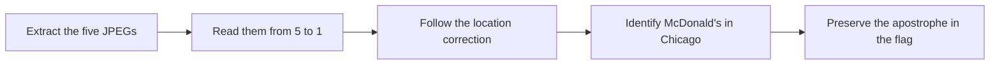

  <button class="lang-btn active" role="tab" type="button" data-lang="en" aria-selected="true">EN</button>
  <button class="lang-btn" role="tab" type="button" data-lang="vn" aria-selected="false">VN</button>

## Đề bài

Bob Burke (`bubu77`) bị thêm nhầm vào một nhóm chat Chatterly. Các ảnh chụp hội thoại tiếng Trung chứa
manh mối về doanh nghiệp và thành phố của mục tiêu tiếp theo. Định dạng cờ là
`cdctf{Business_in_City}`.

## Cách giải

Giải nén năm ảnh JPEG và đọc theo thứ tự thời gian từ ảnh 5 đến ảnh 1, vì các ảnh có những đoạn hội
thoại trùng nhau. Ở đoạn lúc 9:20, một tin nhắn sửa lại địa điểm: đó là một McDonald's ở Chicago,
không phải nhà hàng chung chung ở Mỹ hay một doanh nghiệp ở Đức.

Các tin nhắn lúc 9:33–9:35 tiếp tục nhắc lại McDonald's, xác nhận cặp doanh nghiệp và thành phố cần
điền vào cờ. Dấu nháy ASCII trong tên thương hiệu là một phần của đáp án; biến thể bỏ dấu nháy bị từ
chối.

⇒ **Flag:** `cdctf{McDonald's_in_Chicago}`

## Challenge

Bob Burke (`bubu77`) was accidentally added to a Chatterly group. Screenshots of the Chinese
conversation contain clues identifying the business and city of the next target. The flag format is
`cdctf{Business_in_City}`.

## Solution

Extract the five JPEG screenshots and read them in chronological order from image 5 back to image 1,
because several parts of the conversation repeat. In the 09:20 exchange, a correction identifies the
location as a McDonald's in Chicago, rather than a generic US restaurant or a German business.

Messages at 09:33–09:35 repeat the McDonald's reference and confirm the business/city pair. The ASCII
apostrophe in the brand name is part of the accepted answer; the spelling without it was rejected.

⇒ **Flag:** `cdctf{McDonald's_in_Chicago}`

