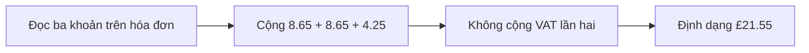
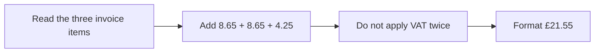

  <button class="lang-btn active" role="tab" type="button" data-lang="en" aria-selected="true">EN</button>
  <button class="lang-btn" role="tab" type="button" data-lang="vn" aria-selected="false">VN</button>

## Đề bài

Hóa đơn Five Guys ở Oxford liệt kê ba khoản 8,65 bảng, 8,65 bảng và 4,25 bảng. Đề hỏi tổng số đã trả, bao gồm VAT.

## Cách giải

Cộng ba dòng được 21,55 bảng. Giá niêm yết của Five Guys UK đã bao gồm VAT, nên cộng thêm 20% lần nữa sẽ tính thuế hai lần. Giữ ký hiệu bảng Anh và hai chữ số thập phân.

⇒ **Flag:** `cdctf{£21.55}`

## Challenge

The Oxford Five Guys receipt lists £8.65, £8.65, and £4.25. The prompt asks for the amount paid including VAT.

## Solution

The three lines total £21.55. Five Guys UK menu prices already include VAT, so adding another 20% would double-count it. Preserve the pound symbol and two decimal places.

⇒ **Flag:** `cdctf{£21.55}`

