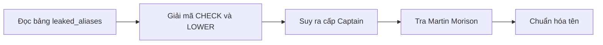
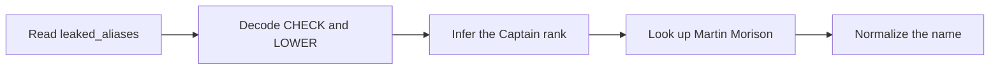

  <button class="lang-btn active" role="tab" type="button" data-lang="en" aria-selected="true">EN</button>
  <button class="lang-btn" role="tab" type="button" data-lang="vn" aria-selected="false">VN</button>

## Đề bài

Bản ghi cuộc gọi nhập vai lính AEF dùng từ mã thời Thế chiến thứ nhất; đề hỏi ai sẽ đi xe máy tới điểm hẹn. Danh sách leaked_aliases.txt ánh xạ cấp bậc sang tên thật.

## Cách giải

Đối chiếu bảng mã: CHECK chỉ xe máy và LOWER chỉ cấp bậc Captain. Cụm “lower by check” trong cuộc gọi chỉ vị Captain, tức Martin Morison trong danh sách bí danh. Dùng tên và họ viết thường, ngăn bằng dấu gạch dưới.

⇒ **Flag:** `cdctf{martin_morison}`

## Challenge

The intercepted call roleplays AEF soldiers using First World War code words; the task asks who is arriving by motorcycle. leaked_aliases.txt maps ranks to real names.

## Solution

The codebook maps CHECK to motorcycle and LOWER to Captain. “Lower by check” therefore identifies the Captain, Martin Morison in the alias list. Lowercase his first and last name and join them with an underscore.

⇒ **Flag:** `cdctf{martin_morison}`

