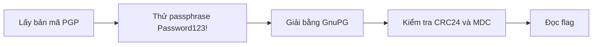
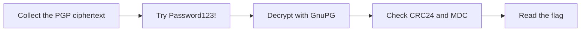

  <button class="lang-btn active" role="tab" type="button" data-lang="en" aria-selected="true">EN</button>
  <button class="lang-btn" role="tab" type="button" data-lang="vn" aria-selected="false">VN</button>

## Đề bài

Đề phát một thông điệp PGP được khóa bằng passphrase. Dùng bản mã ASCII-armored, bảng từ tham chiếu và khóa PGP để kiểm tra passphrase.

## Cách giải

Passphrase `Password123!` mở được khóa PGP. Dùng GnuPG giải thông điệp; kiểm tra CRC24 của bản mã và kết quả `GOODMDC`. Bản rõ bắt đầu bằng “Good work:” rồi chứa flag; giữ nguyên chữ hoa và chữ số trong chuỗi.

⇒ **Flag:** `cdctf{pr3t7y_g00d_piv4cy_fl4G}`

## Challenge

The challenge provides a passphrase-protected PGP message. Use the ASCII-armored message, reference word list, and PGP key to test the passphrase.

## Solution

The passphrase `Password123!` unlocks the PGP key. Decrypt the message with GnuPG, checking the ciphertext CRC24 and `GOODMDC` result. The plaintext begins “Good work:” and then contains the flag; preserve its capitalization and digits.

⇒ **Flag:** `cdctf{pr3t7y_g00d_piv4cy_fl4G}`

