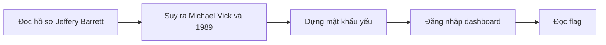
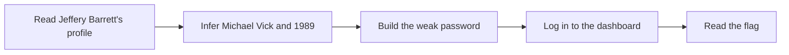

  <button class="lang-btn active" role="tab" type="button" data-lang="en" aria-selected="true">EN</button>
  <button class="lang-btn" role="tab" type="button" data-lang="vn" aria-selected="false">VN</button>

## Đề bài

Giai đoạn hai yêu cầu đăng nhập quản trị bằng mật khẩu yếu của một lãnh đạo. Hồ sơ Crimson Social về Jeffery Barrett và gia đình cung cấp thói quen đặt mật khẩu dựa trên vận động viên, năm sinh và ký tự đặc biệt.

## Cách giải

Đối chiếu trò chơi Madden NFL 2004, nhân vật trên bìa là Michael Vick, với năm sinh 1989 của con trai Brandon. Mật khẩu theo mẫu đó mở dashboard quản trị, nơi chứa flag của giai đoạn này.

⇒ **Flag:** `cdctf{Whats-a-password-policy-anyways?}`

## Challenge

Stage two requires administrator access using an executive’s weak password. Crimson Social profiles of Jeffery Barrett and his family reveal a habit of combining an athlete, a birth year, and a special character.

## Solution

Correlate the cover athlete of Madden NFL 2004, Michael Vick, with Brandon’s birth year, 1989. The resulting pattern opens the admin dashboard, which contains this stage’s flag.

⇒ **Flag:** `cdctf{Whats-a-password-policy-anyways?}`

